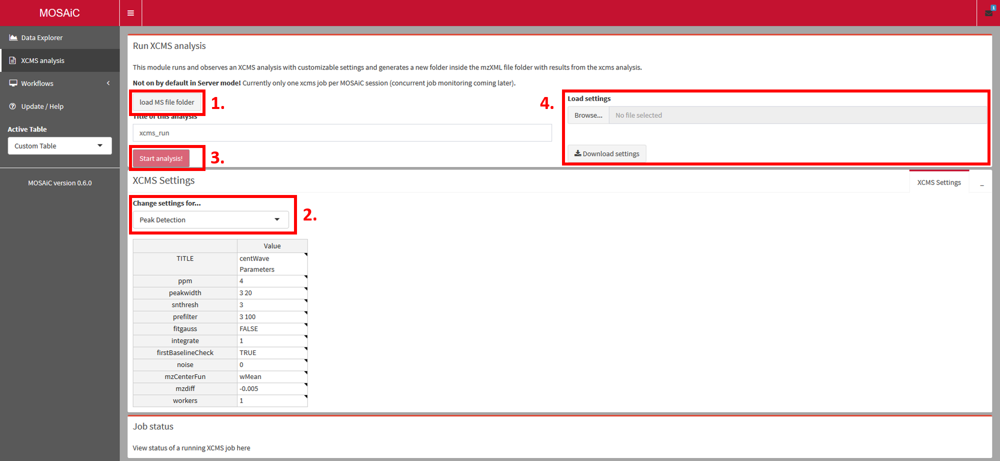
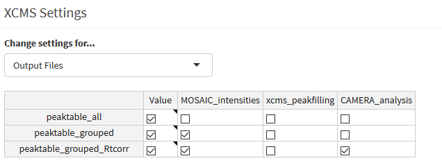

```{r setup, include=FALSE}
knitr::opts_chunk$set(echo = TRUE)
```

METABOseek is an interactive, browser-based tool to analyze and browse your mass spectrometry data. Here is a quick introduction to the basic functions.

# Install METABOseek

## System requirements

Recommended minimal system requirements:

* Quad-core processor (or dual core with 4 threads)
* 8 GB of RAM (16 GB or more are preferred)
* Recent versions of Firefox or Chrome web browsers (METABOseek should work on any browser, but testing is done for these two)

We recommend computers with a monitor with at least full HD (1920 x 1080 pixels) resolution. You can use the zoom function of your web browser to scale the interface to your liking.

All files are loaded into memory, so that browsing will be very quick: It is easy to look at extracted ion chromatograms (EICs) for many MS features of interest across dozens of files within a fraction of a second. However, the initial loading of the data will take some time, and you may experience issues if you load many files at a time. We strongly recommend using centroided data files, as they will have a smaller memory footprint. Loading 50 data files from 20-minute high resolution LC/MS data acquisition should not be a problem on a computer with 16 GB of RAM. 

### Java {#javainfo}
Metaboseek, as pre-packaged in the installer or .zip file for Windows, version 0.9.3 and up **requires** Java. If you install Metaboseek manually, Java is still needed for full functionality. Make sure to install 64-bit Java if you are running 64-bit R (which is most likely), or 32-bit Java if you are running 32-bit R. If you go to java.com and follow the download buttons there, it will send you to download the version that corresponds to your browser (32- or 64-bit) by default, which may or may not be the version you need. Get the appropriate Java version from this page: [https://www.java.com/en/download/manual.jsp](https://www.java.com/en/download/manual.jsp). 


## Use the web version
If you have trouble installing METABOseek and want to just try it out with an example dataset, use the [web version.](https://metaboseek.com/)


## Install on Windows

You will need to get the [appropriate java version](#javainfo), which in the case of the .zip file and the installer, is **64-bit**.

###Using the installer

1. Download the installer of the most recent release version [here](https://github.com/mjhelf/METABOseek/releases)
2. Follow the installation steps.
3. METABOseek 0.9 should now be installed and can be launched like any other Windows program. When METABOseek launches, a command line window will appear, and the user interface will open up in your default web browser. To close the program, close the METABOseek command line window.

###Using a .zip file

1. Download the .zip file of the most recent release version [here](https://github.com/mjhelf/METABOseek/releases)
2. Unzip the file on your computer (this may take a while!)
3. Run METABOseek by executing runMETABOseek.exe In the unzipped folder.

###Updating METABOseek for Windows

Windows users can update METABOseek to the newest version from inside the METABOseek app (Update/Help section in the navigation bar on the left). This method is easier than downloading a new installer or .zip file, but currently updates can fail, especially when there are a lot of changes to METABOseek.
   
## Install on Mac / Linux

1.	[Download](https://cloud.r-project.org/) and install R.
2.	Mac users: Get [Xcode](https://itunes.apple.com/us/app/xcode/id497799835?mt=12).
3.	Run R, enter this line:
```{r, eval = FALSE}
source("http://metaboseek.com/files/install_METABOseek.R") 
```


5. To run METABOseek, enter this line into your R console:
```{r, eval = FALSE}
METABOseek::runMseek()
```


##	Experienced R users (Windows, Mac or Linux):
If you have installed R (and the devtools package) already, you can install METABOseek like this:

```{r, eval = FALSE}
devtools::install_github("mjhelf/METABOseek", ref="master")
```
If you want to make sure you get all the required packages, run the install script with this line:

```{r, eval = FALSE}
source("http://metaboseek.com/files/install_METABOseek.R") 
```	
#Quickstart

#Data analysis with METABOseek

With METABOseek, you can quickly visualize data from batches of high-resolution LC/MS data files and find differences between groups of samples. It is not necessary to do any analysis before looking at your data, but a typical workflow starts with a data analysis step:

* Detection of MS features (defined by m/z and retention time) with the [xcms analysis module](#runXcms)
  + alternatively, you can use an MS feature list that you generated elsewhere.
* Molecular networking of MS2 spectra
* Structure prediction using [SIRIUS](https://bio.informatik.uni-jena.de/software/sirius/)

Then, you can use METABOseek to browse the data, find molecular features of interest, predict the molecular formula and make structure predictions based on MS2 data.


## Overview
METABOseek is structured into two major sections, the `Data Explorer` section for visualization and statistical analysis tasks, and the `XCMS analysis` to identify LC/MS features in MS data files. You can switch between these sections with the navigation menu on the left of the screen. 


## Data Explorer

At the heart of METABOseek is the interaction between data visualization in the "Data viewer" box, and a table of LC/MS data features in the `Feature table` box

###Load MS Data into METABOseek {#loadMSData}

In most cases, the first thing you want to load is some LC/MS data to look at. You can load files from the `Start page`, or click on the "Load..." icon on the left side of the top navigation bar.

### Supported file types {#supportedFiles}

METABOseek uses the `MSnbase` and `xcms` packages to load MS data files of the following formats:

* .cdf
* .nc
* .mzData
* .mzML
* .mzXML

####1. Select a folder with MS data files.{.unnumbered}
All files with [supported file extensions](#supportedFiles) in the selected folders and all its subfolders will be imported, so it makes sense to pre-sort your files in a reasonable folder structure. Note that here, unlike for the [xcms analysis](#runXcms), you may want to include widely different samples (e.g. blanks, to visually confirm they do not contain a compound of interest).

####2. Load a METABOseek project folder.{.unnumbered}
When you run [xcms through METABOseek](#runXcms), the program generates a project folder that contains the results from that xcms analysis run, and all settings that were used in it. If you select a project folder, all MS data files from an analysis will be loaded and grouped in the same way you set up for the xcms analysis. METABOseek will then ask you which feature table you want to load from the project folder, and will load it in the `Feature table` box.  


###Load feature tables

###Visualize EICs

###Interactive MS data view

###View MS/MS data

If you have [loaded MS data files](#loadMSData) which contain MS/MS data, go to the `MS2 browser` tab in the `Data viewer` box to look at MS/MS scans in one of two ways:

####1. Use the feature table{.unnumbered}

When you select one (or multiple) entries in the `Feature Table`, METABOseek will find any MS/MS scans that have a parent mass matching the selected `Feature Table` entry (e.g. within 5 ppm and 200 seconds, customizable).

####2. Use the molecular network viewer{.unnumbered}

If you have loaded or generated a molecular network, you can also display spectra for each network node, as long as the files used to generate the network are [loaded into METABOseek.](#loadMSData) Navigate from the network overview to a contingent network cluster (or "subgraph") by clicking on it while holding the `SHIFT` key. The view will now zoom in on the subgraph. You can use the control menu above the network to show node and edge labels of your choice (e.g. Parent m/z and m/z difference between nodes ("deltaMZ")), and apply a coloring scheme (e.g. color by default groups). To select a node and display all MS/MS spectra associated with it, click on a node while holding the `SHIFT` key.

You can move nodes by dragging them with your mouse while holding the `CTRL` key (this helps make all labels visible in a dense network). Return back to the network overview by double clicking on the graph.


###Get structure predictions with SIRIUS

[SIRIUS](https://bio.informatik.uni-jena.de/software/sirius/) is a stand-alone software developed in the Boecker lab at the University of Jena that can use MS/MS data to predict the molecular formulas of fragment and parent ion peaks. It also offers an interface to CSI:FingerID to match fragmentation patterns with structure databases.

MS2 data can be analyzed with SIRIUS from inside the Metaboseek app. For this to work, you first need to tell Metaboseek where the SIRIUS executable is located. Click on the "Global settings for Metaboseek" button at the top of the app (gear symbol, next to the "Open..." button). Select the SIRIUS folder. Metaboseek will generate a new folder there to store results from Sirius runs.

To run Sirius, use the "Run SIRIUS" Button above the MS2 scan table. Make sure to select appropriate options in the "Sirius options" section at the top of the app (Options box).
The results can be accessed through Metaboseek as soon as a Sirius analysis run finishes by clicking "Show SIRIUS". Select items in the tables that show up to view fragmentation trees and proposed structures.

####Manage and compare MS2 spectra{.unnumbered}

All MS/MS scans matching a selection (from a network or from the `Feature Table`) are shown in a table in the `MS2 browser` tab. An average spectrum of all scans shown in this `scan table` is displayed on the left. You can select single or multiple scans in the `scan table` to show the spectrum of only the selected scan(s).

MS/MS spectra are shown on the right side. You can choose to `keep` a spectrum view - it will then not be overridden when you select a new `Feature table` entry or network node. You can show up to 5 spectrum views at the same time. By default, all peaks that occur in more than one of the shown spectra are highlighted in blue. You can disable this comparison with the `Compare` checkbox. You can also download the shown spectrum views in .pdf format by clicking `Download spectra`.

##XCMS analysis {#runXcms}

This section will help you to set up an xcms analysis in METABOseek in order to identify LC/MS features that are differential between sets of data files. This can, for instance, be useful to assess the impact of a mutation on the metabolome of an organism or to identify compounds associated with the activity of an enzyme.



1. Select a folder with MS data files. All files with [supported file extensions](#supportedFiles) in the selected folders and all its subfolders will be listed, so it makes sense to pre-sort your files in a reasonable folder structure:
  + All files should be acquired under comparable conditions, especially with the same polarity. Differences in LC gradient or general composition (e.g. through widely different extraction methods, or comparing samples and blanks) can also make it difficult to find differential features.
2. There are 7 tables with xcms settings you can change here. Navigate through them with the drop down menu highlighted as (2.). A short description for each parameter is given when you hover over the table entries. You can use the default settings and proceed to step 3 without changing any of them. 
The default is for highly similar LC/MS runs acquired at high resolution and high accuracy (< 5 ppm), and will find relatively small peaks (even if they only occur in a single replicate) with a relatively long runtime.
  + Output files: select which output files you want to get.  
3. Start the analysis
4. You can save settings as a .zip file (on windows computers, 7-zip or other software allowing for the zip command line prompt must be installed), or load a .zip file with settings from a previous run.
 + Note that this will override your selection of MS data files. If you want to apply the settings to a new set of data files, load the settings first and then select a folder (step 1).
 

