```{r setup, include=FALSE}
knitr::opts_chunk$set(echo = TRUE)
htmltools::tagList(rmarkdown::html_dependency_font_awesome())
htmltools::tagList(rmarkdown::html_dependency_bootstrap("default"))


#library(Metaboseek)
```

<style>
#TOC {
  background: url(https://raw.githubusercontent.com/mjhelf/Metaboseek/devel_raw/vignettes/img/logo_web_full_240.png);
  background-size: 150px;
  padding-top: 180px !important;
  background-repeat: no-repeat;
  background-position-x: center;
}
</style>

```{r, eval = TRUE, echo = FALSE}

print(paste("Metaboseek version:",packageVersion("Metaboseek")))
```

# Metaboseek Documentation


Metaboseek offers a graphical user interface to set up data analysis with the `xcms` package to detect and align molecular features from LC/MS data across multiple samples. You can then load xcms results into the app as a "Feature Table" (using `xcms` and [`MSnbase`](https://bioconductor.org/packages/release/bioc/html/MSnbase.html) packages, [`mzR`](https://bioconductor.org/packages/release/bioc/html/mzR.html)-based) and run statistical analyses to identify molecular features of interest.

* Filter the xcms results, view and export chromatograms and mass spectra for molecular features of interest.

* Generate and view molecular networks based on tandem-MS spectrum similarity between molecular features (using [`MassTools`](https://github.com/mjhelf/MassTools) and [`igraph`](https://github.com/igraph/rigraph) packages).

* Annotate fragments in tandem-MS spectra with [SIRIUS](https://bio.informatik.uni-jena.de/software/sirius/).

This document describes all UI elements in Metaboseek and is meant to be a comprehensive 
user manual.

# Install Metaboseek

## System Requirements

Recommended minimal system requirements:

* Quad-core processor (or dual core with 4 threads)
* 8 GB of RAM (16 GB or more are preferred)
* Recent versions of Firefox or Chrome web browsers (Metaboseek should work on any browser, but testing is done for these two)

We recommend computers with a monitor with at least full HD (1920 x 1080 pixels) resolution. You can use the zoom function of your web browser to scale the interface to your liking.

All files are loaded into memory, so that browsing will be very quick: It is easy to look at extracted ion chromatograms (EICs) for many MS features of interest across dozens of files within a fraction of a second. However, the initial loading of the data will take some time, and you may experience issues if you load many files at a time. We strongly recommend using centroided data files, as they will have a smaller memory footprint. Loading 50 data files from 20-minute high resolution LC/MS data acquisition should not be a problem on a computer with 16 GB of RAM. 

### Java {#javainfo}
If installed from an R session, Metaboseek will require Java to be installed for full functionality (in particular, molecular structure plotting in the SIRIUS module. Java is also a requirement for installing SIRIUS itself). Make sure to install 64-bit Java if you are running 64-bit R (which is most likely), or 32-bit Java if you are running 32-bit R. If you go to java.com and follow the download buttons there, it will send you to download the version that corresponds to your browser (32- or 64-bit) by default, which may or may not be the version you need. Get the appropriate Java version from this page: [https://www.java.com/en/download/manual.jsp](https://www.java.com/en/download/manual.jsp). 

## Install on Windows

### Using the Installer

1. Download the installer of the most recent release version <a href="https://github.com/mjhelf/Metaboseek/releases" target = "_blank">here</a>
2. Follow the installation steps.
3. Metaboseek 0.9 should now be installed and can be launched like any other Windows program. When Metaboseek launches, a command line window will appear, and the user interface will open up in your default web browser. To close the program, close the Metaboseek command line window.

The installer version of Metaboseek has one limitation: it does not plot molecular structures for predicted structures in the SIRIUS module. This is a compromise made so that this installation of Metaboseek does not require Java to be installed on your system.

### Using a .zip File

1. Download the .zip file of the most recent release version <a href="https://github.com/mjhelf/Metaboseek/releases" target = "_blank">here</a>
2. Unzip the file on your computer (this may take a while!)
3. Run Metaboseek by executing runMetaboseek.exe In the unzipped folder.

The .zip version of Metaboseek has one limitation: it does not plot molecular structures for predicted structures in the SIRIUS module. This is a compromise made so that this installation of Metaboseek does not require Java to be installed on your system.

<!-- ###Updating Metaboseek for Windows -->

<!-- Windows users can update Metaboseek to the newest version from inside the Metaboseek app (Update/Help section in the navigation bar on the left). This method is easier than downloading a new installer or .zip file, but currently updates can fail, especially when there are a lot of changes to Metaboseek. -->

## Install on Mac / Linux
Consider getting the [Metaboseek Docker image](#Docker), or follow these steps to install Metaboseek:

1.	<a href="https://cloud.r-project.org/" target = "_blank">Download</a>.
2.	Mac users: Get Xcode by entering this line into your `Terminal` window:
```
xcode-select --install
```
* Follow the instructions. This will install parts of Xcode that are required to install Metaboseek.
3.	Run R, enter this line:
```{r, eval = FALSE}
source("http://metaboseek.com/files/install_Metaboseek.R") 
```
* If there is an error during installation, try to additionally install
<a href="https://itunes.apple.com/us/app/xcode/id497799835?mt=12" target = "_blank">Xcode</a> from the AppStore.
5. To run Metaboseek, enter this line into your R console:
```{r, eval = FALSE}
Metaboseek::runMseek()
```
* If Metaboseek starts up, but an unresponsive grey screen appears, there is most likely an issue related to the rcdk package and Java). Restart R and enter this line:
```
remove.packages('rcdk')
```
Then try to run Metaboseek again.


## Get the Docker Image {#Docker}

As they put it on their website, "Docker provides a way to run applications securely isolated in a container, packaged with all its dependencies and libraries.". This is also a convenient way to reproduce analysis results that were generated with a particular version of Metaboseek. Once you have set up Docker on your computer, this is the easiest and most reproducible way to get fully functional Metaboseek, including [SIRIUS](https://bio.informatik.uni-jena.de/software/sirius/) integration. 

1. [Install](https://docs.docker.com/install/) and [set up](https://docs.docker.com/get-started/) Docker. Please note that there are limitations for Windows users (Windows 10 Pro is required and using Docker prevents running Virtual Machines with VM VirtualBox).
2. You can now get the <a href="https://hub.docker.com/r/mjhelf/metaboseek" target = "_blank">Metaboseek Docker image</a> using this terminal command:
```
docker pull mjhelf/metaboseek
```
The metaboseek Docker image is based on the [`bioconductor/release_metabolomics2`](https://hub.docker.com/r/bioconductor/release_metabolomics2) image.
3. Running this command will execute the latest version of the Metaboseek container (and download it if not already available on your computer):
```
docker run -d -v HOSTFOLDER:/home/shiny/data -p 3840:80 -e PASSWORD=YOURPASSWORD mjhelf/metaboseek
```
Lets take a look at some key settings here:

* `HOSTFOLDER` should be the path of a folder on your computer that contains all data that you want to analyze with Metaboseek, for example if used like this:
```
docker run -d -v /home/user123:/home/shiny/data -p 3840:80 -e PASSWORD=YOURPASSWORD mjhelf/metaboseek
```
**NOTE:** The apps hosted inside the container will be accessible from the internet (for anyone connecting to your computer's IP address and the correct port number). By default, they will be protected by HTTP basic authentication, but that is not 100% secure. Once authenticated, the apps allow seeing the data structure of the specified HOSTFOLDER, and it is possible to download arbitrary .csv files and MS data from that folder. We are not liable for any data exposure to unauthorized parties or other [damages](https://github.com/mjhelf/METABOseek/blob/master/LICENSE).

All contents of the `/home/user123` folder will be acessible in Metaboseek.
* `-p 3838:3838` means that port 3838 from the container will be accessible as port 3840 on the host computer.

* `-e PASSWORD=YOURPASSWORD` this password has to be set. It can be used if you want to access rstudio inside the container, and is necessary to access the Metaboseek apps.

* You can disable authentication for the apps by adding `-e PROTECTED=false` to this command, for instance to provide convenient public access to your data. **WARNING: This makes the apps accessible from the internet (see note above)**

4. Check if the Metaboseek container is running:
```
docker ps
```
5. Go to your web browser and go to the website `localhost:3840`, where the port number after the colon may differ based on your `-p` setting (see above). By default, you will have to log in, with the username `metaboseek` and the password you specified (`YOURPASSWORD` in our example). This will open a website, hosted inside the metaboseek container. Select the app you want to run and analyze your data!


##	Experienced R users (Windows, Mac or Linux):
If you have installed R (and the devtools package) already, you can install Metaboseek like this:

```{r, eval = FALSE}
devtools::install_github("mjhelf/MassTools")
devtools::install_github("mjhelf/Metaboseek")
```
If you want to make sure you get all the required packages, run the install script with this line:

```{r, eval = FALSE}
source("http://metaboseek.com/files/install_Metaboseek.R") 
```	


## Use the web version
If you have trouble installing Metaboseek and want to just try it out with an example dataset, use the [web version.](https://metaboseek.com/)

<!-- #Quickstart -->

<!-- The easiest way to try out some basic funcionality is to load in the example data. In the online version, the data is already preloaded, and you can skip the first step that describes how to load the data. -->

# Data Analysis with Metaboseek

With Metaboseek, you can quickly visualize data from batches of high-resolution LC/MS data files and find differences between groups of samples. It is not necessary to do any analysis before looking at your data, but a typical workflow starts with a data analysis step:

* Detection of MS features (defined by m/z and retention time) with the [xcms analysis module](#runXcms)
  + alternatively, you can use an MS feature list that you generated elsewhere.
* Molecular networking of MS2 spectra
* Structure prediction using [SIRIUS](https://bio.informatik.uni-jena.de/software/sirius/)

Then, you can use Metaboseek to browse the data, find molecular features of interest, predict the molecular formula and make structure predictions based on MS2 data.

## Overview
Metaboseek is structured into two major sections, the `Data Explorer` section for visualization and statistical analysis tasks, and the `XCMS analysis` to identify LC/MS features in MS data files. You can switch between these sections with the navigation menu on the left of the screen. 

## Navigation Bar Items{#NavbarItems}

The buttons in the navigation bar either help with the user interface, or allow quick
access to important functionalities.
{width=100%}

### Interface Buttons
The leftmost <svg style="height:0.8em;top:.04em;position:relative;" viewBox="0 0 448 512"><path fill="currentColor" d="M16 132h416c8.837 0 16-7.163 16-16V76c0-8.837-7.163-16-16-16H16C7.163 60 0 67.163 0 76v40c0 8.837 7.163 16 16 16zm0 160h416c8.837 0 16-7.163 16-16v-40c0-8.837-7.163-16-16-16H16c-8.837 0-16 7.163-16 16v40c0 8.837 7.163 16 16 16zm0 160h416c8.837 0 16-7.163 16-16v-40c0-8.837-7.163-16-16-16H16c-8.837 0-16 7.163-16 16v40c0 8.837 7.163 16 16 16z"></path></svg>`Menu`button can be used to hide the navigation bar on the left side, allowing you to maximize screensize. Likewise, you can use the <svg class="bi bi-arrows-fullscreen" width="1em" height="1em" viewBox="0 0 20 20" fill="currentColor" xmlns="http://www.w3.org/2000/svg">
  <path fill-rule="evenodd" d="M4 11.5a.5.5 0 01.5.5v3.5H8a.5.5 0 010 1H4a.5.5 0 01-.5-.5v-4a.5.5 0 01.5-.5z" clip-rule="evenodd"/>
  <path fill-rule="evenodd" d="M8.854 11.11a.5.5 0 010 .708l-4.5 4.5a.5.5 0 11-.708-.707l4.5-4.5a.5.5 0 01.708 0zm7.464-7.464a.5.5 0 010 .708l-4.5 4.5a.5.5 0 11-.707-.708l4.5-4.5a.5.5 0 01.707 0z" clip-rule="evenodd"/>
  <path fill-rule="evenodd" d="M11.5 4a.5.5 0 01.5-.5h4a.5.5 0 01.5.5v4a.5.5 0 01-1 0V4.5H12a.5.5 0 01-.5-.5zm4.5 7.5a.5.5 0 00-.5.5v3.5H12a.5.5 0 000 1h4a.5.5 0 00.5-.5v-4a.5.5 0 00-.5-.5z" clip-rule="evenodd"/>
  <path fill-rule="evenodd" d="M11.146 11.11a.5.5 0 000 .708l4.5 4.5a.5.5 0 00.708-.707l-4.5-4.5a.5.5 0 00-.708 0zM3.682 3.646a.5.5 0 000 .708l4.5 4.5a.5.5 0 10.707-.708l-4.5-4.5a.5.5 0 00-.707 0z" clip-rule="evenodd"/>
  <path fill-rule="evenodd" d="M8.5 4a.5.5 0 00-.5-.5H4a.5.5 0 00-.5.5v4a.5.5 0 001 0V4.5H8a.5.5 0 00.5-.5z" clip-rule="evenodd"/>
</svg>`Fullscreen` button to maximize the size of the browser window.

### Functional Buttons

#### Load MS Data, Feature Tables or Sessions
The <svg style="height:0.8em;top:.04em;position:relative;" viewBox="0 0 576 512"><path d="M572.694 292.093L500.27 416.248A63.997 63.997 0 0 1 444.989 448H45.025c-18.523 0-30.064-20.093-20.731-36.093l72.424-124.155A64 64 0 0 1 152 256h399.964c18.523 0 30.064 20.093 20.73 36.093zM152 224h328v-48c0-26.51-21.49-48-48-48H272l-64-64H48C21.49 64 0 85.49 0 112v278.046l69.077-118.418C86.214 242.25 117.989 224 152 224z"/></svg> `Load` button allows you to load MS data, feature Tables and entire Metaboseek projects, [as detailed here.](#loadMSData).

#### Save Session
Use the <i class="glyphicon glyphicon-floppy-disk"></i>`Save` button to  save the current Metaboseek session.
This will save all Feature Tables, Molecular Networks and MS data files that you have loaded into the current session. You can choose to include the MS data 
in the session file (e.g. for simple sharing of an analysis with colleagues). However, this will increase file size significantly and may slow down the 
saving process. If MS data is not included in the saved session, Metaboseek will expect the MS data files to be in the same location when you load the session.

#### Global Options
Settings available <svg style="height:0.8em;top:.04em;position:relative;" viewBox="0 0 512 512"><path fill="currentColor" d="M487.4 315.7l-42.6-24.6c4.3-23.2 4.3-47 0-70.2l42.6-24.6c4.9-2.8 7.1-8.6 5.5-14-11.1-35.6-30-67.8-54.7-94.6-3.8-4.1-10-5.1-14.8-2.3L380.8 110c-17.9-15.4-38.5-27.3-60.8-35.1V25.8c0-5.6-3.9-10.5-9.4-11.7-36.7-8.2-74.3-7.8-109.2 0-5.5 1.2-9.4 6.1-9.4 11.7V75c-22.2 7.9-42.8 19.8-60.8 35.1L88.7 85.5c-4.9-2.8-11-1.9-14.8 2.3-24.7 26.7-43.6 58.9-54.7 94.6-1.7 5.4.6 11.2 5.5 14L67.3 221c-4.3 23.2-4.3 47 0 70.2l-42.6 24.6c-4.9 2.8-7.1 8.6-5.5 14 11.1 35.6 30 67.8 54.7 94.6 3.8 4.1 10 5.1 14.8 2.3l42.6-24.6c17.9 15.4 38.5 27.3 60.8 35.1v49.2c0 5.6 3.9 10.5 9.4 11.7 36.7 8.2 74.3 7.8 109.2 0 5.5-1.2 9.4-6.1 9.4-11.7v-49.2c22.2-7.9 42.8-19.8 60.8-35.1l42.6 24.6c4.9 2.8 11 1.9 14.8-2.3 24.7-26.7 43.6-58.9 54.7-94.6 1.5-5.5-.7-11.3-5.6-14.1zM256 336c-44.1 0-80-35.9-80-80s35.9-80 80-80 80 35.9 80 80-35.9 80-80 80z"></path></svg> :

* **Enabled cores:** Number of CPU threads to use for parallel processing jobs. Changes to this settings require a restart of 
Metaboseek (close and restart the process)

* **Per page:** Set how many Features should be shown per page for the Main Feature Table. Very large numbers here will slow down 
browsing the table.

* **Database Folder:** Currently not used

* **Sirius Folder:** NOTE: This setting has been moved to the Sirius options Tab of the [Options Box](#OptionsBox) in Metaboseek 0.9.6.3.

## Start Page / Loading Data {#loadMSData}

{width=100%}


The <svg style="height:0.8em;top:.04em;position:relative;" viewBox="0 0 576 512"><path d="M280.37 148.26L96 300.11V464a16 16 0 0 0 16 16l112.06-.29a16 16 0 0 0 15.92-16V368a16 16 0 0 1 16-16h64a16 16 0 0 1 16 16v95.64a16 16 0 0 0 16 16.05L464 480a16 16 0 0 0 16-16V300L295.67 148.26a12.19 12.19 0 0 0-15.3 0zM571.6 251.47L488 182.56V44.05a12 12 0 0 0-12-12h-56a12 12 0 0 0-12 12v72.61L318.47 43a48 48 0 0 0-61 0L4.34 251.47a12 12 0 0 0-1.6 16.9l25.5 31A12 12 0 0 0 45.15 301l235.22-193.74a12.19 12.19 0 0 1 15.3 0L530.9 301a12 12 0 0 0 16.9-1.6l25.5-31a12 12 0 0 0-1.7-16.93z"/></svg> `Start` page provides you with information
about the newest version of Metaboseek, and also allows you to load data into Metaboseek. You can also click on the <svg style="height:0.8em;top:.04em;position:relative;" viewBox="0 0 576 512"><path d="M572.694 292.093L500.27 416.248A63.997 63.997 0 0 1 444.989 448H45.025c-18.523 0-30.064-20.093-20.731-36.093l72.424-124.155A64 64 0 0 1 152 256h399.964c18.523 0 30.064 20.093 20.73 36.093zM152 224h328v-48c0-26.51-21.49-48-48-48H272l-64-64H48C21.49 64 0 85.49 0 112v278.046l69.077-118.418C86.214 242.25 117.989 224 152 224z"/></svg> `Load` icon on the left side of the navigation bar at the top of the page to get the same set of options for loading data:

### Load Feature Tables
[You can load any .csv or .mskFT file into Metaboseek](#supportedFiles). You can
then go to the "Regroup Table" tab to specify or change the columns that contain intensity values.
Feature Tables contain the results from feature detection with xcms, along with
results from statistical analysis. If you load an `.mskFT` file, important metadata, such as
processing history and sample grouping are loaded along with the result table.
If you have loaded a project folder into the current session, there is a convenient option to select
all compatible table files from the project folder as well.

### Loading MS Data Files Directly.{.unnumbered}
All files with [supported file extensions](#supportedFiles) in the selected 
folders and all its subfolders can be imported, either by selecting files
individually (selecting multiple files at a time is possible), or by importing 
an entire folder that contanis MS data (will import all compatible files from 
all subfolders, too). To save time, it makes sense to pre-sort 
your files in a reasonable folder structure (e.g. separate positive mode data
from negative mode so you don't get both kinds when selecting a folder to load
into Metaboseek). Loading MS data files after you have already loaded a project 
folder allows you to visually inspect files that you had excluded from the 
[xcms analysis](#runXcms), such as blanks.

### Load a Metaboseek Project Folder.{#projectFolders}
When you run [xcms through Metaboseek](#runXcms), the program generates a 
project folder that contains the results from that xcms analysis run, and all 
settings that were used in it. In addition, all output feature tables you 
requested will be saved in the project folder during the xcms run.
You can load this result folder into Metaboseek, making it easier to keep all
analysis results related to this xcms run in one place.

You can either select a project folder anywhere on your computer, or select a 
project folder from the recent project selection window that lists the most recently
used project folders (load the selected folder with the `Load Recent` button).
If you chose to load a project folder, all MS data files from the xcms run will be 
loaded and sample grouping information from the xcms analysis will be applied.
Metaboseek will ask you which feature table you want to load
from the project folder. If you select an `.mskFT` file (recommended) instead of 
the corresponding `.csv` file, you will benefit from the additional information embedded in these files. 
`.csv` files are primarily there for export and viewing in other tools (and even Microsoft Excel),
 while `.mskFT` files are designed to be loaded back into Metaboseek. The advantage of 
 `.mskFT` files is that they contain the complete processing history (including
 settings used for the xcms run, CAMERA analysis and post-processing). `.mskFT` files 
 are technically `.RDS` files containing an `MseekFT` object and can be loaded 
 into any R session with the `readRDS()` function.
 
#### Load Example Data
You can select "example_projectfolder" from the "Recent projects" selection box and click on "Load recent".
Metaboseek will ask you which table you would like to load into the session along with the MS data that is associated with the exammple project folder.

### Load a Metaboseek Session
You can load a Metaboseek session that you saved previously in an `.msks` file. 
This will restore all feature tables and MS data files you had loaded into that session along with
many of the layout settings.
**Note:** This will currently only work if the MS data file locations have not 
changed from the paths used in the old session. Some aspects of the session will
not be restored (notably, molecular networks are not saved in the session file).


### Supported File Types {#supportedFiles}

Metaboseek uses the `MSnbase` and `xcms` packages to load MS data files of the following formats:

* .cdf
* .nc
* .mzData
* .mzML
* .mzXML

Feature Tables can be loaded in these formats:

* .csv : comma-separated values. Metaboseek will expect a column `mz` with m/z values and a column `rt` 
with retention time values in seconds.
* .mskFT: Metaboseek's format to keep feature tables with metadata, including processing history

## Data Explorer

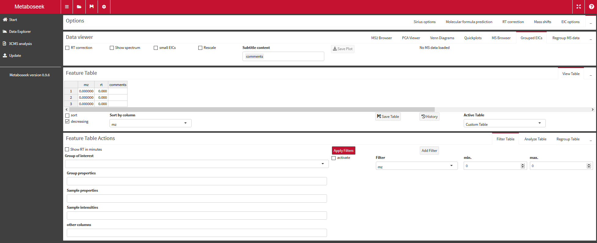{width=100%}


At the heart of Metaboseek is the interaction between data visualization in the "Data viewer" box, and a table of LC/MS data features in the `Feature table` box

### Options Box {#OptionsBox}

This box provides a number of optional functionality, including setting up SIRIUS,
calculating molecular formulas and controling the appearance of extracted ion 
chromatograms (EICs) in the `Data Viewer` box.

#### Sirius Options

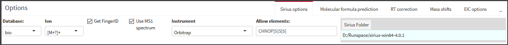{width=100%}

The settings here are passed on the the SIRIUS executable. Please have a look at the [SIRIUS documentation](https://bio.informatik.uni-jena.de/software/sirius/)
to learn more about them.

* **Database:** Restrict SIRIUS molecular structures and FingerID searches to a database. Search PubChem for most results (many of which may not be relevant in a biological context).

* **Ion:** Select the ion type. Make sure to select the correct charge (positive or negative), and consider specifying the adduct type only if you are certain of it.

* **Get FingerID:** If this box is checked, SIRIUS will also run a FingerID query in the selected database, returning a list of molecules matching your spectrum. If you unselect this setting, only the SIRIUS fragmentation tree is generated.

* **Use MS1 spectrum:** Option to use MS1 level information for the search. Will use the the MS1 scan closest to the retention time of the current MS2 spectrum from the MS2 browser. If multiple MS2 spectra are selected, only one MS1 scan gets used (should be the one corresponding to the first scan in the MS2 scan list (when not using sorting)).

* **Instrument:** Select the type of instrument that was used for data acquisition

* **Allow elements:** Enter Element symbols you want to include in the search without spaces. To limit the maximum number of an element per molecule,
add a number in brackets after the Element symbol (e.g. `CHNOP[5]S[5]`)

* **Sirius Folder:** Path to a SIRIUS executable


#### Molecular Formula Prediction

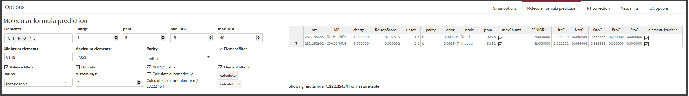{width=100%}


In this Tab, you can calculate molecular formulas that match the currently selected feature's m/z value. All settings 
are passed to the `calcMF` function from the `MassTools` package. Molecular formulas are generated with the [`Rdisop`]() package and can then 
be filtered using the rules proposed by the "Seven Golden Rules for heuristic filtering of molecular formulas obtained by accurate mass spectrometry" (@Kind2007), as well as some additional filters. For detailed documentation, [click here](https://rdrr.io/github/mjhelf/MassTools/man/calcMF.html).

* **Elements:** Elements that are allowed to be in the proposed molecules
* **Charge:** Charge of the ion, can be a positive or negative integer, or zero.
* **ppm:** Maximum relative difference between input and theoretical m/z value
* **min./max. DBE:** Minimum and Maximum number of double bond equivalents (DBE).
* **Minimum/Maximum Elements:** a molecula formula defining the minimum or maximum number of atom counts for a set of elements.
* **Parity:** Must be odd (o), even (e) or either. Correct selection depends on your ionization method.
* **Element filter:** Check each predicted molecula formula for maximum number of elements expected in a natural product of its size ("Golden Rule #1")
* **Valence filters:** for each predicted molecula formula, calculate the sum of valences minus twice (the number of atoms minus 1) (to check for Senior's third theorem, "Golden Rule #2")
* **H/C ratio:** molecular formulas must have a Hydrogen/ Carbon count ratio of >0.2 and <3.1 ("Golden Rule #4"). Will be ignored if no Hydrogen or Carbon present in a molecule.
* **NOPS/C ratio:** molecular formulas must have these atom count ratios: Nitrogen/Carbon <1.3, Oxygen/Carbon <1.2, Phosphorus/Carbon <0.3 and Sulfur/Carbon <0.8 ("Golden Rule #5"). Will be ignored if no Carbon present in a molecule.
* **Element filter 2:** additional element ratio heuristic is applied (various element ratios need to be in the "common range" for natural products, Golden Rule #6")
* **source:** source of the m/z value that you want to analyze. By default (`feature table`), the m/z value is taken from the current selection in the Feature Table. If `spectrum` is selected, you can select a peak of interest from the MS1 Spectrum in the `Data viewer` -> `Grouped EICs` tab or the MS2 Spectrum from the `Data viewer` -> `MS2 Browser` -> `Compare MS2` spectra.  To feed peaks selected in the MS2 spectrum shown next to the scan table in `Data viewer` -> `MS2 Browser`. Select peaks from spectra by pressing Shift + click. Selected peaks will be marked in orange. selecting `custom` as source will use the m/z value that you specify in the `custom m/z` field.
* **calculate automatically:** Generate molecular formulas automatically as soon as your source m/z value changes (e.g. every time you change the selection in the `Feature Table`). This may slow down Metaboseek when looking for high mass molecules.
* **calculate/calculate all:** Generates molecular formulas with the current settings for all m/z values in the Feature Table and adds a column called `predicted_MFs` to the `Feature Table`.

#### RT Correction

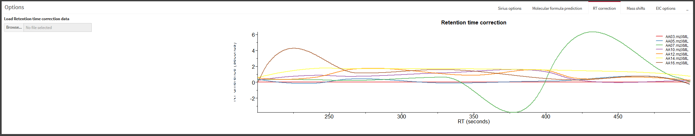{width=100%}


If you load a `Project Folder` from a finished xcms job that included retention time correction, you can review the effect of retention time correction across your files here. Retention time is plotted on the x-axis for each file, and deviation from the uncorrected retention time is shown on the y-axis. Very large RT deviations or very different behavior between groups of samples can point to problems with your chromatography setup or retention time correction settings.

#### Mass Shifts

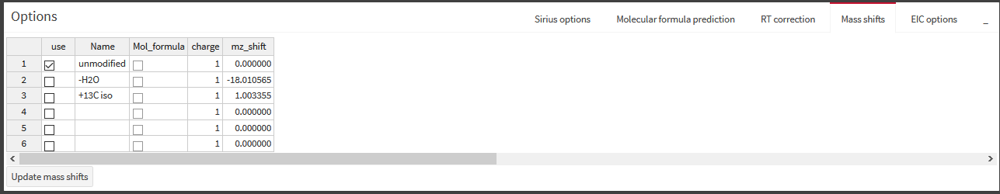{width=100%}


You can define mass shifts that will be shown in the `Data viewer` -> `Grouped EICs` window as additional EIC traces (in dashed lines). Mol_formula and charge columns are currently ignored. Click `Update mass shifts` to update the EIC view and to save your edits to the mass shift table (will be restored in your next session). 

#### EIC Options

{width=100%}


This allows control of various formatting options for the EICs in `Data viewer` -> `Grouped EICs` as well as `Data viewer` -> `MS2 Browser` -> `Feature Report`, and in part also for `Data viewer` -> `MS Browser`

* **Mass tol (ppm):** Relative mass tolerance in parts per milion (ppm) around the m/z value selected in the `Feature Table` for generation of extracted ion chromatograms (EICs).
* **Plots per row:** Maximum number of EIC plots per row, will add additional rows of plots if necessary.
* **TIC:** Plot Total Ion Chormatogram (TIC) instead of EIC. Will ignore the m/z value selected in the `Feature Table` but will use its retention time information.
* **Relative intensities:** Change y-axis labels to percentages instead of raw intensity numbers.
* **RT window (sec):** width of the retention time range in the EIC plots, +/- from the retention time defined in `Feature Table` `rt` column.
* **Full RT range:** Show chromatogram for entire retention time range instead of using RT window.
* **Group by:** Use this Group to define which files get plotted in the same EIC plot; Edit grouping information in `Data viewer` -> `Regroup MS data`.
* **Y-axis zoom:** Zoom in on the Y-axis (intensity) by this factor. Use this to inspect small peaks that would otherwise not be visible because they are plotted in the same plot as large peaks.
* **Line width:** Thickness of the EIC lines
* **Mark feature RT:** Show a dashed line at the retention time as defined in the `Feature Table` `rt` column
* **Raise EICs:** Raise up the y-axis view so you can see sections of the EIC that are close to zero and may be hidden behind the x-axis
* **Font size:** Control the font size for axis labels in EIC plots.
* **Color palette:** Change the color scheme for EIC traces.
* **Color by:** Use this Group to define which files get plotted in the same color; Edit grouping information in `Data viewer` -> `Regroup MS data`. Coloring by `Mass shift` not implemented yet.


### Data Viewer

This box provides plots of data that is selected in the `Feature Table` box.
Different kinds of data plots and browsing options are available, mostly for 
extracted ion chromatograms (EICs) and spectrum plots, but also bar plots,
venn diagrams and plots from principal component analysis.


#### MS2 Browser
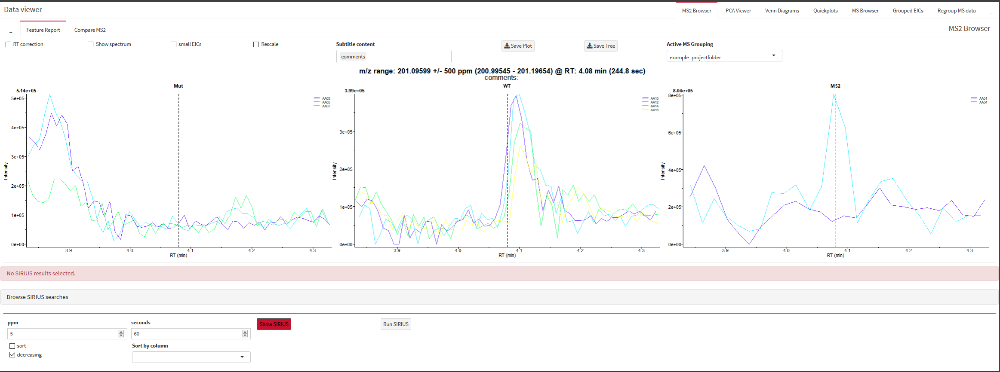{width=100%}

If you have [loaded MS data files](#loadMSData) which contain MS2 (tandem-MS) data,
you can go to the `MS2 browser` for a variety of data analysis options specifically for 
MS2 data.  The `MS2 Browser` box is the most complex tab in Metaboseek, and its 
user interface is divided into three parts: The two sub-tabs `Feature report` and 
`Compare MS2`, and a bottom part that is always visible, independent of which sub-tab
is selected. This `General MS2 Browser` part includes the SIRIUS module and
the list of MS2 scans associated with the selected row in the `Feature Table`.

#### Sub-Tabs

You can switch between two views in the `MS2 browser`:

##### Feature Report{.unnumbered}

The `Feature Report` sub-tab is designed to show all information about a molecular feature at one glance and make it exportable as a single page .pdf document.
This includes Grouped EICs at the top (see ["Grouped EICs" description](#GroupedEICs) for description of the controls for this). If MS2 data is available for a molecular feature selected in the `Feature Table`, MS1 (left) and MS2 (right) spectra are also shown below the EICs.

{width=100%}

##### Compare MS2{.unnumbered}

In this sub-tab, you can compare MS2 spectra with each other. On the left side,
you see space for the molecular network viewer. MS/MS spectra are shown on the 
right side. 

###### Molecular Network Module{.unnumbered}

* **Make a new MS2 network:** Here, you can analyze MS2 data and find molecular
features with similar MS2 spectra, which can indicate structural similarity. 
Click on the "New MS2 Network" button to get started.
First, you need to associate MS2 spectra with molecular features in the 
`Feature Table`. This step is identical to the "Find MS2 scans" dialog described
in the [Advanced Analysis](#AdvancedAnalysis) section, and you can skip it if you
already ran this analysis step on the current `Feature Table` and want to use 
the same MS2 association parameters (m/z and RT tolerance, etc.) as before.


MS2 scans are averaged for each molecular feature, and then the averaged spectra 
are compared with each other. In the next step, you can select the parameters
used for spectrum sililarity calculations. Only peaks that match within the m/z
and ppm tolerance between two spectra will be used to calculate the similarity 
score, and peaks at an intensity below a set percentage of the maximum peak 
intensity in a scan (`Noise level in %`) will be excluded. You can also 
`ignore small fragments`, an experimental feature that will exclude peaks with 
m/z < 100 m/z from the spectra, which can be used for instance to exclude 
phosphate peaks which can be very dominant in negative mode data. The similarity score
will be considered 0 if less than `min. peaks` match between two spectra. 

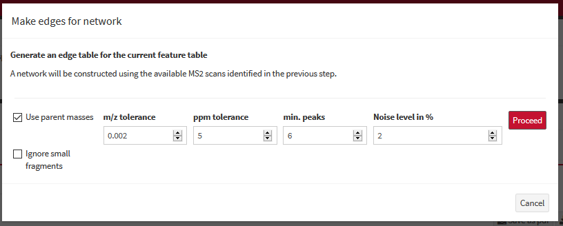{width=70%}

The intensities of the matching peaks for each spectrum are extracted, an the
similarity score is calculated as the cosine between these intensity vectors, i.e.
a simlar relative intensity distribution of intensities is expected for the matching
peaks for similar compounds. If you select `Use parent masses`, neutral losses are
also used for peak matching, which will increase the number of matching peaks for 
compounds that have different parent masses (e.g. because of a methyl group or adduct
difference). This step can take minutes or even hours, depending on the number 
of molecular features with MS2 scans that are compared to each other. For
more details, look at the documentation for the 
[`makeEdges()`](https://rdrr.io/github/mjhelf/MassTools/man/makeEdges.html) 
and [`network1()`](https://rdrr.io/github/mjhelf/MassTools/man/network1.html)
functions from the [`MassTools`](https://github.com/mjhelf/MassTools) package.

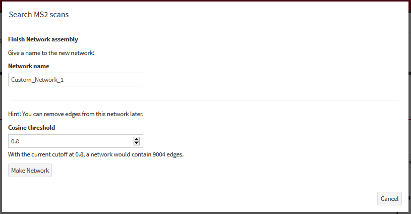{width=70%}

After calculation of the similarity scores, you can give your new network a name
and select a threshold for which comparisons to keep (above a given 
`Cosine threshold`). Stricter (higher) values generate less data and less 
complicated networks, generally with less netowork clusters. A less strict 
(lower) `Cosine threshold` will keep more of the comparison information which 
you can remove later with the `Simplify network` button:

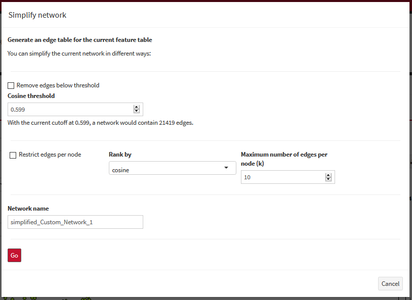{width=70%}


You can save networks in either the .graphML or .mskg format. 

* **Use the molecular network viewer:** If you have loaded or generated a 
molecular network, you can also display spectra for each network node, as long 
as the files used to generate the network are [loaded into Metaboseek.](#loadMSData)
Navigate from the network overview to a contingent network cluster (or "subgraph")
by clicking on it while holding the `SHIFT` key. The view will now zoom in on the
subgraph. You can use the control menu above the network to show node and edge labels
of your choice (e.g. Parent m/z and m/z difference between nodes ("deltaMZ")),
and apply a coloring scheme (e.g. color by default groups). To select a node and
display all MS/MS spectra associated with it, click on a node while holding the
`SHIFT` key.

{width=100%}

You can move nodes by dragging them with your mouse while holding the `CTRL` key 
(this helps make all labels visible in a dense network). Return back to the network
overview by double clicking on the graph. If double-clicking does not work,
you can also zoom out by clicking while holding the `Z` key. 

The processing history for the current network can be viewed with the <svg style="height:0.8em;top:.04em;position:relative;" viewBox="0 0 512 512"><path fill="currentColor" d="M504 255.531c.253 136.64-111.18 248.372-247.82 248.468-59.015.042-113.223-20.53-155.822-54.911-11.077-8.94-11.905-25.541-1.839-35.607l11.267-11.267c8.609-8.609 22.353-9.551 31.891-1.984C173.062 425.135 212.781 440 256 440c101.705 0 184-82.311 184-184 0-101.705-82.311-184-184-184-48.814 0-93.149 18.969-126.068 49.932l50.754 50.754c10.08 10.08 2.941 27.314-11.313 27.314H24c-8.837 0-16-7.163-16-16V38.627c0-14.254 17.234-21.393 27.314-11.314l49.372 49.372C129.209 34.136 189.552 8 256 8c136.81 0 247.747 110.78 248 247.531zm-180.912 78.784l9.823-12.63c8.138-10.463 6.253-25.542-4.21-33.679L288 256.349V152c0-13.255-10.745-24-24-24h-16c-13.255 0-24 10.745-24 24v135.651l65.409 50.874c10.463 8.137 25.541 6.253 33.679-4.21z"></path></svg> `History` button.


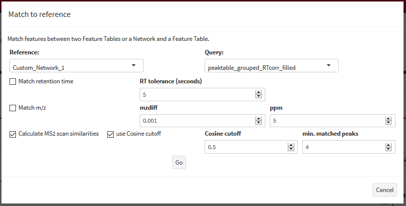{width=100%}
<svg style="height:0.8em;top:.04em;position:relative;" viewBox="0 0 640 512"><path fill="currentColor" d="M519.2 127.9l-47.6-47.6A56.252 56.252 0 0 0 432 64H205.2c-14.8 0-29.1 5.9-39.6 16.3L118 127.9H0v255.7h64c17.6 0 31.8-14.2 31.9-31.7h9.1l84.6 76.4c30.9 25.1 73.8 25.7 105.6 3.8 12.5 10.8 26 15.9 41.1 15.9 18.2 0 35.3-7.4 48.8-24 22.1 8.7 48.2 2.6 64-16.8l26.2-32.3c5.6-6.9 9.1-14.8 10.9-23h57.9c.1 17.5 14.4 31.7 31.9 31.7h64V127.9H519.2zM48 351.6c-8.8 0-16-7.2-16-16s7.2-16 16-16 16 7.2 16 16c0 8.9-7.2 16-16 16zm390-6.9l-26.1 32.2c-2.8 3.4-7.8 4-11.3 1.2l-23.9-19.4-30 36.5c-6 7.3-15 4.8-18 2.4l-36.8-31.5-15.6 19.2c-13.9 17.1-39.2 19.7-55.3 6.6l-97.3-88H96V175.8h41.9l61.7-61.6c2-.8 3.7-1.5 5.7-2.3H262l-38.7 35.5c-29.4 26.9-31.1 72.3-4.4 101.3 14.8 16.2 61.2 41.2 101.5 4.4l8.2-7.5 108.2 87.8c3.4 2.8 3.9 7.9 1.2 11.3zm106-40.8h-69.2c-2.3-2.8-4.9-5.4-7.7-7.7l-102.7-83.4 12.5-11.4c6.5-6 7-16.1 1-22.6L367 167.1c-6-6.5-16.1-6.9-22.6-1l-55.2 50.6c-9.5 8.7-25.7 9.4-34.6 0-9.3-9.9-8.5-25.1 1.2-33.9l65.6-60.1c7.4-6.8 17-10.5 27-10.5l83.7-.2c2.1 0 4.1.8 5.5 2.3l61.7 61.6H544v128zm48 47.7c-8.8 0-16-7.2-16-16s7.2-16 16-16 16 7.2 16 16c0 8.9-7.2 16-16 16z"></path></svg> 
"Match Feature Table" is an **experimental beta feature**: You can map the current `Feature Table` on the currently
active MS2 network, re-using the network layout. This is still in development and will change over time.


###### Compare Spectra{.unnumbered}

In the "MS2 spectra" box on the right, you can choose to `keep` a spectrum view - it will then 
not be refreshed when you select a new `Feature table` entry or network node. 
Instead, a new spectrum plot will show up below. You can show up to 5 spectrum 
views at the same time. By default, all peaks that occur in more than one of the 
shown spectra are highlighted in blue. You can disable this comparison with the 
`Compare` checkbox. You can also download the shown spectrum views in .pdf 
format by clicking `Download spectra`, or in .tsv format (`Save as table`). 


#### General MS2 Browser

Below the sub-tab selection, you can see these elements:

#### SIRIUS Module{.unnumbered}
[SIRIUS](https://bio.informatik.uni-jena.de/software/sirius/) (@Duhrkop2019) is a stand-alone software developed in the Boecker lab at the University of Jena that can use MS/MS data to predict the molecular formulas of fragment and parent ion peaks. It also offers an interface to CSI:FingerID to match fragmentation patterns with structure databases.

{width=100%}


Information about completed SIRIUS analyses will show up here if available for the
active molecular feature from the `Feature Table`.

##### Get Structure Predictions with SIRIUS

MS2 data can be analyzed with SIRIUS from inside the Metaboseek app. All 
settings for SIRIUS can be found in the [`Options box`](#OptionsBox). In the 
`Sirius options`, you first need to tell Metaboseek where the SIRIUS executable 
is located ("SIRIUS folder"). Metaboseek will generate a new folder there to 
store results from Sirius runs. NOTE: Make sure you have write access to the
SIRIUS location.

To run Sirius, use the "Run SIRIUS" Button above the MS2 scan table. Make sure 
to select appropriate options in the `Sirius options` section at the top of the 
app `Options box`.
The results can be accessed through Metaboseek as soon as a Sirius analysis run
finishes by clicking "Show SIRIUS" in the Spectra list. Select items in the tables that show up to 
view fragmentation trees and proposed structures.
Two buttons for SIRIUS are in the `Spectra list` section below: 
The `Run SIRIUS` button will use the currently selected spectra with the current
`Sirius options` to run a SIRIUS analysis. This will typically take a few seconds. 
The `Show SIRIUS` button will show SIRIUS results for the selected MS2 spectra when available.
The color of the button indicates if SIRIUS results are available (green),
not available (red), or available with settings that differ from the current
settings in `Sirius options` (yellow).

You can select molecular formulas from the SIRIUS result table on the left to 
display the corresponding fragmentation tree. The annotated fragments will also 
be highlighted in the `Feature report` subtab MS2 spectrum view. If you selected
`Get FingerID` in the `Sirius options`, a list of candidate molecules will show 
up on the right side. Select one to view the molecular structure. NOTE: Viewing
molecular structures requires installation of the `rcdk` package, which is not
included in the Metaboseek Windows installer, and not automatically installed 
when installing Metaboseek from R.

Click on the `Browse SIRIUS searches` section to show a list of SIRIUS jobs. 
Select a job here to look at SIRIUS results independent from the current 
`Feature Table` selection.

{width=100%}


##### Spectra List{.unnumbered}
{width=100%}

When you select one (or multiple) entries in the 
`Feature Table`, Metaboseek will find any MS/MS scans that have a parent mass 
matching the selected `Feature Table` entry (e.g. within 5 ppm and 200 seconds,
customizable). All MS/MS scans matching a selection (from a network or from the 
`Feature Table`) are shown in a table in the `MS2 browser` tab. 

You can define the parent ion m/z tolerance (in ppm) and retention time window
at the top, allowing you to only show MS2 scans that are within these tolerances 
from your selection in the `Feature Table`. You can also sort this table with 
the controls at the bottom of the table. An average spectrum of all scans shown 
in this `scan table` is displayed on the left. You can select single or multiple 
scans in the `scan table` to show the spectrum of only the selected scan(s). 
The MS2 scans selected here are also used and displayed by both, the 
`Feature Report` and `Compare MS2` sub-tabs.


#### PCA Viewer
Shows interactive plots with results from the principal component analysis (PCA)
from the `Feature Table Actions` [Analysis Options](#AnaOptions) if available.

#### Venn Diagrams
This module allow you to filter the `Feature Table` in up to three different groups
and show the number of overlaps between the groups. You can define the grouping
by applying up to three different filters to the current `Feature Table`. The
filters work like in the [Filter Table Tab](#FilterTable)

#### Quickplots
In this tab, you can view the data in summary plots. The left side uses the
intensity values from the feature table as input, while the right side allows
you to plot arbitrary `Feature Table` columns against each other.

#### MS Browser
Here, you can select individual files to show their EICs for the selected feature
or a custom m/z value. You can use SHIFT + click to select a data point to display
the corresponding MS1 spectrum below. See the ["Navigating plots"](#NavPlots)
section for more information on how to interact with the spectrum and EIC plots.

* **Add EIC:** Add another EIC view

You can display multiple independent EIC views at the same time. Each of them 
has these settings:

* **Remove:** Remove this EIC view
* **Download EIC:** Generate a .pdf file from this current EIC view
* **RT correction:** Apply retention time (RT) correction to the EICs, if available.
RT correction information automatically loaded when opening project folders, but can also
be added to the session from the `RT correction` Tab in the [`Options` box](#OptionsBox)
* **TIC:** Show Total Ion Current (TIC) instead of EIC.
* **Hotlink mz and rt ranges:** If selected, uses the m/z and rt range for this EIC view from the
current selection in the `Feature Table`.
* **m/z:** Displays the m/z used for this EIC view, can be edited if the hotlink is not active
* **select files:** select files for which to show EICs in this EIC view.

Other settings for the EIC plots, such as mass tolerance and color palette,
can be changed in the `EIC options` in the [`Options` box](#OptionsBox) and will
apply to all EIC plots in Metaboseek.

#### Grouped EICs{#GroupedEICs}
Similar to the MS Browser (see above), but enabling different layouts of grouped
EICs. Some plotting parameters can be changed in the `EIC options` in the [`Options` box](#OptionsBox),
and some can be changed here directly:

* **RT correction:** Apply retention time (RT) correction to the EICs, if available.
RT correction information automatically loaded when opening project folders, but can also
be added to the session from the `RT correction` Tab in the [`Options` box](#OptionsBox)
* **Show spectrum:** Shows a spectrum plot underneath the EICs, for the scan with the highest intensity 
visible in any of the `Grouped EICs` plots. You can interact with the plot as described [here](#NavPlots).
* **Small EICs:** Decreases the height of the EIC plots to save vertical space 
* **Rescale:** If selected, will rescale all plots so that they are relative to 
the highest intensity across all current plot groups, instead of relative to the highest intensity within each group.
* **Subtitle context:** Here, you can select which columns from the `Feature Table`. Their content will be shown in the plots as subtitle.
* **Save Plot:** This will generate a .pdf file with grouped EICs for all features
in the `Feature Table` (after applying the active filters) with grouped EICs for one feature per page. 
**IMPORTANT:**  The **limit** for number of features that can be exported to pdf this way is **1000**.
Make sure you filter your results accordingly before exporting, otherwise only the EIC plots for the first 1000 features get exported.
* **Active MS grouping:** You can switch between different grouping schemes that \
you defined in the `Regroup MS data` Tab.

#### Regroup MS Data
You can group the MS data independently from the grouping in the `Feature Table`.
This grouping can be used to define color schemes or which files should be plotted
together in `Grouped EICs`.
It is possible to assign each file to two different groups to allow switching plot
layouts using `EIC options` in the [`Options` box](#OptionsBox).
You can define multiple grouping schemes here with the 'new Grouping' and 'Update Grouping' buttons
and switch between these schemes from the `Grouped EICs` Tab.

### Feature Table

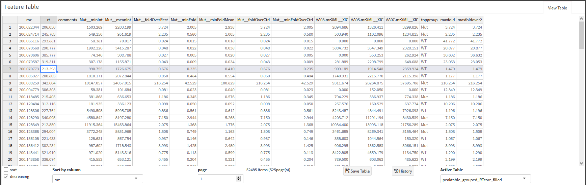{width=100%}


This box contains the most important element in the app: the `Feature Table`.
Most plots in the `Data Viewer` will use this table as input to show you information
that is related to the molecular feature that is defined in the selected row.

* **sort:** switch sorting the table on or off
* **decreasing:** sort in decreasing or increasing order
* **Sort by column:** which column to sort by
* **page:** select which page to show. You can change the number of items per page in the <svg style="height:0.8em;top:.04em;position:relative;" viewBox="0 0 512 512"><path fill="currentColor" d="M487.4 315.7l-42.6-24.6c4.3-23.2 4.3-47 0-70.2l42.6-24.6c4.9-2.8 7.1-8.6 5.5-14-11.1-35.6-30-67.8-54.7-94.6-3.8-4.1-10-5.1-14.8-2.3L380.8 110c-17.9-15.4-38.5-27.3-60.8-35.1V25.8c0-5.6-3.9-10.5-9.4-11.7-36.7-8.2-74.3-7.8-109.2 0-5.5 1.2-9.4 6.1-9.4 11.7V75c-22.2 7.9-42.8 19.8-60.8 35.1L88.7 85.5c-4.9-2.8-11-1.9-14.8 2.3-24.7 26.7-43.6 58.9-54.7 94.6-1.7 5.4.6 11.2 5.5 14L67.3 221c-4.3 23.2-4.3 47 0 70.2l-42.6 24.6c-4.9 2.8-7.1 8.6-5.5 14 11.1 35.6 30 67.8 54.7 94.6 3.8 4.1 10 5.1 14.8 2.3l42.6-24.6c17.9 15.4 38.5 27.3 60.8 35.1v49.2c0 5.6 3.9 10.5 9.4 11.7 36.7 8.2 74.3 7.8 109.2 0 5.5-1.2 9.4-6.1 9.4-11.7v-49.2c22.2-7.9 42.8-19.8 60.8-35.1l42.6 24.6c4.9 2.8 11 1.9 14.8-2.3 24.7-26.7 43.6-58.9 54.7-94.6 1.5-5.5-.7-11.3-5.6-14.1zM256 336c-44.1 0-80-35.9-80-80s35.9-80 80-80 80 35.9 80 80-35.9 80-80 80z"></path></svg> `Global Options` ([Navigation bar at the top of the app](#NavbarItems))
* **Save Table:** You can save the `Feature Table` in multiple formats, and either
download it through your browser, or save it in an automatically generated subfolder
of your project folder (if you are working with xcms results from a Metaboseek project folder).
The recommended format is `.mskFT`, because it retains the processing history information
for this `Feature Table` when you load it back into Metaboseek.
For export in other software, use the .csv format. You can also generate inclusion or exclusion lists for Thermo instruments.
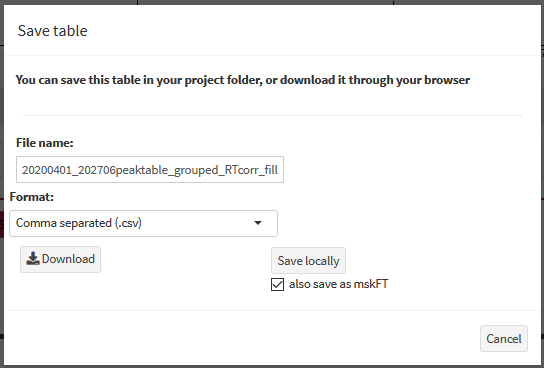{width=70%}


* **History:** Shows you the processing history of the currently active `Feature Table`, including
the processing history from the xcms run (if all steps were done in Metaboseek, and the `Feature Table` was loaded 
in `.mskFT` format):
{width=70%}


* **Active Table:** Select which Feature Table to display in the Feature Table box.
You can load multiple Feature tables and switch between them here (e.g. tables filtered 
for different criteria)

* **Rename:** Rename the currently active Feature Table (names of Feature Tables 
in the current session are displayed in the 'Active Table' selection box)

### Feature Table Actions

In this box you can run analyses on the currently selected `Feature Table` and filter it.

#### Special Columns in the Metaboseek Feature Table{#columnExplain}

Some column names and name schemes are generated by the actions you can take in the `Analyze Table` Tab.
You can use these columns to filter your `Feature Table` in the `Filter Table` Tab.

```{r column legend, echo = FALSE}

coldf <- read.csv("assets/columnLegend.csv")

colnames(coldf) <- c("Column", "Description", "calculated by", "method")

knitr::kable(coldf[,1:3])


```


#### Filter Table{#FilterTable}

{width=100%}


You can filter the `Feature Table` here by specifying a column and filter criteria.
Columns containing text can be filtered for text patterns, and numeric columns for 
values within a range. You can define an arbitrary number of filters and it is 
possible to activate or deactivate individual filter steps.
IMPORTANT: when you save a `Feature Table`, the currently active filters will be 
applied before saving.

#### Analyze Table

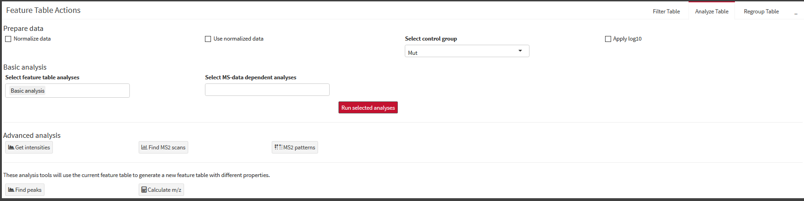{width=100%}

The `Analyze Table` tab is the central hub for data analysis on your
`Feature Table`. Most analysis steps will generate new columns in the `Feature Table`
which you can then use to filter your table to get to your features of interest.
[See below](#columnExplain) for a guide to the columns generated by the analysis
steps. 


##### Analysis Options{#AnaOptions}

For more in-depth information on the underlying functions in `R`, see <a href="https://rdrr.io/github/mjhelf/METABOseek/man/analyzeFT.html" target = "_blank"> the Metaboseek::analyzeFT documentation</a>.

* **Normalize data: **Select this option ONLY if the current table has not been 
filtered and is the result of an unbiased xcms analysis. "Normalization" will make a copy
of the current intensity columns with the suffix "__norm". In these new columns, 
all zero intensity values will be set to the lowest non-zero value across all
sample intensity columns (assuming it represents the detection limit). Then, a 
normalization factor is applied so that the average intensiy of each individual
column is the same and equal to the average intensity across all columns prior to 
normalization. **If you do this on a table that has been pre-filtered, for instance 
containing only features that are upregulated in one sample group, this will fatally
distort the data!**

* **Use normalized data: ** Use the normalized data for when running analyses that 
use intensity values: Basic Analysis, anova, t-test, PCA, clara cluster

* **Select control group:** Select a sample group that is the control (in Basic Analysis, all sample groups are compared to this group).

* **Apply log10:** When checked, will apply log10 to the "__norm columns" (see above) **after** normalization of intensity values.

##### Basic Analysis

* **Basic analysis:** Selecting this option will calculate a set of fold changes 
between sample groups and some summary information columns such as `maxint`.
[See below](#columnLegend) for a description of all columns generated by this 
analysis step.

* **clara cluster:** cluster the feature table with cluster::clara()

* **anova:** Calculate per-row one-way ANOVA between grouped columns of the feature table. NOTE: Equal variance is not assumed (uses stats::oneway.test), returns NaN in cases where one group has all equal values (no variance, e.g. if all values are 0).

* **t-test:**  calculate t-test between samples. Works only if there are two groups in grouping with multiple members.

* **PCA features:** Perform Principal Component Analysis (PCA) of features (does not require grouping information). will add columns to the feature table.

* **PCA samples:** Calculate Principal Component Analysis to cluster samples based on the intensity columns (does not require grouping information). sample PCA information is not stored in the viewable feature table, but is saved as part of an .mskFT file.

* **mzMatch: ** Match the m/z values of your featureTable to a list of known compounds.
Note that these matches based on MS1 data alone are ambiguous. Will generate multiple columns
in the `Feature Table`, as described [below](#columnLegend).

* **Peak shapes:** Tries to match the EIC for each feature in each sample to a curve and calculates a fit score between 0 (no fit) and 1 (best fit).

* **Fast peak shapes:** Recommended way to score peak shapes. Tries to match the EIC for each feature in the sample with the highest intensity for each feature to a curve and calculates a fit score between 0 (no fit) and 1 (best fit). Much faster than "Peak shapes", with equivalent or better results.

##### Advanced Analysis{#AdvancedAnalysis}

* **Get intensities:** For each molecular feature, an EIC is generated across 
all MS files currently loaded in the MS data layout. The retention time boundaries
of the EIC can be chosen to be seconds around the features retention time (rt)
or around its peak boundaries as reported in the rtmin and rtmax columns of the 
feature table. If retention time correction information is used, the EIC 
retention time window is moved accordingly for each file. Intensities within 
this EIC range are averaged and reported for each file. Alternatively, the peak areas
can be calculated instead of the average intensities, leading to results that are 
more easily comparable to xcms-based intensities.

* **Find MS2 scans:** Find MS2 scans corresponding to each feature in the 
Feature Table. Allows setting of m/z and RT tolerances, will add a column to the
Feature Table with information about the scans. This column is used by the MS2 
browser Module to identify feature-specific spectra for MS2 networking.
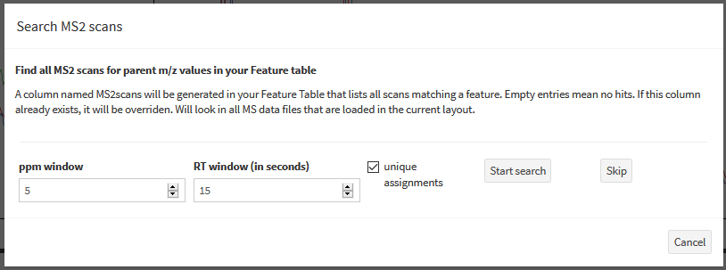{width=70%}

* **MS2 patterns:** Allows to search for combinations of MS2 fragment peaks in all loaded MS data files.

* **Labelfinder:** Find stable isotope labeled compounds in datasets containing labeled and unlabeled samples.

For the Labelfinder, follow these steps:

1. Run two xcms analyses independently for the labeled and the unlabeled samples.

2. Load the results from both analyses into the Metaboseek session (potentially 
use the renaming functionality in the `Feature Table` box to keep track of which results come from
the labeled and unlabeled samples).

3. Make sure to also load all MS files into the session, for both labeled and unlabeled samples.

4. Select the unlabeled `Feature Table` as active table in the `Feature Table` box

5. Open the `Labelfinder` dialog and select the labeled sample feature table.

6. Read the tooltips on the settings for explanations on the individual settings.
You can deselect samples from both the labeled and unlabeled feature tables if necessary

7. Press `Go` to start the `Labelfinder` analysis. This will generate a new `Feature Table`
with likely labeled compounds using the the selected name (by default has "Labelfinder_"
as a prefix). The *unlabeled* features will be reported in the resulting table.

8. To browse the results, you can add the label m/z of interest to the `Options -> Mass shifts`.
This will allow you to see overlays of EICs for the labeled and unlabeled compounds. Note that you
may have to manually load additional raw files (e.g. those for the labeled samples) to display
all relevant information.

<details>
    <summary>Click here for details on the Labelfinder algorithm</summary>
    
The `findLabels()` function compares two Feature Tables with each other, 
assuming that one of them contains an enrichment of labeled compounds.

In a first step, `featlistCompare()` is used to identify entries in the reference (unlabeled) Feature Table
which have a corresponding, labeled feature in the comparison (labeled) Feature Table 
(m/z in comparison Feature Table should be within tolerance of reference m/z + expected label and also within retention time tolerance).

Each entry from the reference Feature Table (dubbed `I1S1`, for Isotopologue 1, Sample Group 1) can have multiple matches in each of these categories:
1. m/z + label match in reference table (`I2S1`)
2. m/z match in comparison table (`I1S2`)
3. m/z + label in comparison table (`I2S2`)

For each match, only the match closest in retention time to `I1S1` is kept for further processing.
Intensities are re-extracted for all matched peaks (`I1S1`, `I2S1`, `I1S2`, `I2S2`), using 
the m/z values identified for `I1S1` (for `I1S1` and `I1S2`) and `I2S2` (for `I1S2` and `I2S2`),
and the rt values for `I1S1` (for `I1S1` and `I2S1`) and `I2S2` (for `I2S2` and `I2S2`).
The extracted intensities are used to calculate mean intensity across the unlabeled (S1) and labeled (S2) samples for both isotopologs.

Key filter criteria that are user-controlled are the minimum ratio of `I1S1/I2S1` 
(because a high ratio is expected in the unlabeled sample `S1` where 
the unlabeled compound `I1` is expected to be more abundant than the labeled compound) and the maximum ratio of `I1S2/I2S2` (where a low value
is indicative of the label being enriched).
The Features from the reference Feature Table which meet the filter criteria are
then exported to a new Feature Table that contains intensity information for 
`I1S1`, `I2S1`, `I1S2` and `I2S2`. The reported m/z and rt values are directly 
carried over from the original reference Feature Table.

</details>

* **Find peaks: ** For each m/z value in the feature table, an EIC for the full 
retention time range is generated, and a simple peak detection algorithm is 
applied to identify maxima that stand out from background noise.

<details>
    <summary>Click here for details on the peak detection algorithm</summary>
    
    the peakDetect() function uses a modified version of an algorithm presented by Ma et al.24 as follows:
For the global noise level, let $N $ be the number of EIC data points, and $S_{i}$ the intensity value of the $i^{th}$ data point. $K$ is a user definable variable.
$GlobalNoiseThreshold = (GlobalMaximum + GlobalAverage)/100 + K * Deviation$
 where :
$GlobalAverage = \displaystyle \frac{\sum_{i=1}^N|S_{i}|}{N}$; $Deviation = \displaystyle \frac{\sum_{i=1}^N|S_{i} - GlobalAverage|}{N}$
In addition to the global noise threshold, a local noise threshold is calculated for each data point $S_{i}$ in the EIC, using a similar equation limited to a small retention time window around $S_{i}$. Let $n$ be the number of scans to consider for local noise level calculation in each direction, and $noise_{i}$ the local noise level for a data point in the EIC.
$noise_{i} = (LocalMaximum + LocalAverage)/2 + K * Local Deviation$
$LocalAverage = \displaystyle \frac{\sum_{i-n}^{i+n}|S_{i}|}{2n + 1}$; $LocalDeviation = \displaystyle \frac{\sum_{i-n}^{i+n}|S_{i} - LocalAverage|}{2n + 1}$
In a first step, all local maxima and their adjacent minima in an EIC are detected, and peak boundaries are defined by the two minima surrounding a maximum. Peaks are selected if their maximum is above both the local noise level at its position in the EIC and above the global noise level. If two peaks are adjacent, and the local minimum that separates them is at least 1/3 the intensity of either peak maximum, these two peaks are merged. Additional filters include selection for peaks spanning at least a given number of scans, and a factor by which a peak maximum has to be above the average intensity inside the peak boundaries.
Peaks are merged between files by first matching peaks with maxima within a specified retention time window. The peak boundary and maximum position are then calculated from the weighted average boundary and maximum positions of all peaks that are matched, weighted by the maximum intensity of each peak.
</details>

* **Calculate m/z:** Allows to calculate m/z values from molecular formulas that are written out in a column of the Feature Table (without charge).

#### Regroup Table

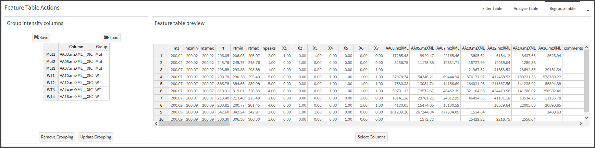{width=100%}


This tab allows you to redefine the columns containing intensity values and 
how they are grouped.

### Navigating Plots{#NavPlots}

Many plots in Metaboseek are interactive and allow you to get more information 
by selecting the elements they display. Mass spectra, some EIC plots
and the network module plot are interactive. To zoom in, drag your mouse 
while holding the left mouse button. A selection square will appear, and you
can double click to zoom in. To zoom out, double click on the plot without selecting
anything. NOTE: Double-clicks currently do not work on some computers, so you
can alternatively click while holding the CTRL key to zoom in or out. In
the Molecular Network view, hold the Z key while clicking to zoom out instead.
To highlight a peak in a spectrum, select a time point in an EIC, a subnetwork 
or node in a network, hold the left SHIFT button and click on your datapoint of choice.
Some plots allow export of the current view in .pdf or text format.
In Spectra, the selected peak is highlighted, and when you mouse over other peaks, 
you can see the mass difference to the highlighted plots. You can also link the 
peak selection to the `Molecular formula prediction` Tab in the `Options` box to
get a list of possible molecular formulas for it. 


## XCMS Analysis {#runXcms}

This section will help you to set up an xcms analysis in Metaboseek in order to identify LC/MS features that are differential between sets of data files. This can, for instance, be useful to assess the impact of a mutation on the metabolome of an organism or to identify compounds associated with the activity of an enzyme.

{width=100%}

1. Select a folder with MS data files. All files with 
[supported file extensions](#supportedFiles) in the selected folders and all its
subfolders will be listed, so it makes sense to pre-sort your files in a reasonable
folder structure:
  + All files should be acquired under comparable conditions, especially with 
  the same polarity. Differences in LC gradient or general composition (e.g. 
  through widely different extraction methods, or comparing samples and blanks) 
  can also make it difficult to apply retention time correction and find 
  differential features.
2. There are 7 tables with xcms settings you can change here. Navigate through 
them with the drop down menu highlighted as (2.). A short description for each 
parameter is given when you hover over the table entries. You can use the 
default settings and proceed to step 3 without changing any of them. 
The default is for highly similar LC/MS runs acquired at high resolution and 
high accuracy (< 5 ppm), and will find relatively small peaks (even if they only
occur in a single replicate). While these settings allow for detection of small
peaks, the processing time is relatively long and many false-positives 
(non-peaks) will also end up in the feature table.

  <details>
    <summary>Click here for details about the xcms settings</summary>

  + **Peak Detection:** set parameters for the [`xcms::findChromPeaks()` function](https://rdrr.io/bioc/xcms/man/findChromPeaks-centWave.html#heading-2)
  + **Peak Filling:** These settings specify how to look for intensities for 
  molecular features in all files, even in files where no peak was detected for
  that feature in the initial Peak Detection step. The xcms peak filling 
  parameters will be used if you select the "Fill peaks with xcms..." output
  option below. Technically, you are setting parameters for the  
  [`xcms::fillChromPeaks()` function](https://rdrr.io/bioc/xcms/man/fillChromPeaks.html).
  You can also set parameters for the Metaboseek peak intensity functions here,
  which will extract intensities for all molecular features in all files.
  + **Feature Grouping:** set the parameters for how xcms will group peaks from different
  files together (also known as correspondence analysis) so that intensities can
  be compared across files. These parameters are used for a call to 
  [`xcms::groupChromPeaks` with `xcms::PeakDensityParam`](https://rdrr.io/bioc/xcms/man/groupChromPeaks-density.html).
  + **Output files:** select which output files you want to get. The values in this 
  table can more conveniently be set in the user interface below the tables
  ("Output selection" section).
  + **CAMERA settings:** Settings for isotope peak and adduct annotation with the
  `CAMERA` package. `Metaboseek` sequentially runs the `CAMERA` package functions
  `xsAnnotate`, `groupFWHM`, `groupCorr`, `findIsotopes` and `findAdducts`
  which are described in the [`CAMERA` documentation](https://bioconductor.org/packages/release/bioc/html/CAMERA.html).
  + **RT correction:** Settings for retention time correction, using 
  [`xcms::adjustRtime`](https://rdrr.io/bioc/xcms/man/adjustRtime.html) either 
  using the [`Obiwarp`](https://rdrr.io/bioc/xcms/man/adjustRtime-obiwarp.html)
  or the [`peakGroups`](https://rdrr.io/bioc/xcms/man/adjustRtime-peakGroups.html)
  method. If `Obiwarp` is selected and fails, the xcms runner script will attempt to run 
  `peakGroups` with the given paramters.
  </details>
  
3. Start the analysis with a click on the "Start analysis!" button.
  + Once the analysis is running, Metaboseek will generate a Project Folder for
  you, containing settings and results from your xcms run. You can load the
  Project Folder back into Metaboseek to keep all your analysis results in one 
  place. See [Project Folders](#projectFolders) for more information.
4. You can save settings as a .zip file (on windows computers, 7-zip or other software allowing for the zip command line prompt must be installed), or load a .zip file with settings from a previous run.
 + Note that loading settings will override your selection of MS data files. If you want to apply the settings to a new set of data files, load the settings first and then select a folder (step 1).


# References

