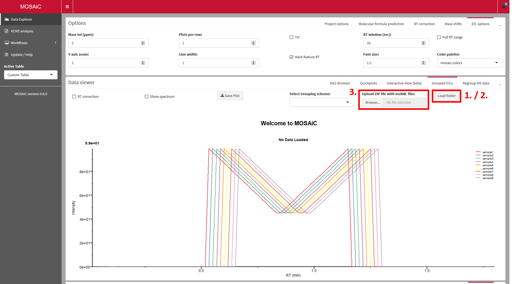
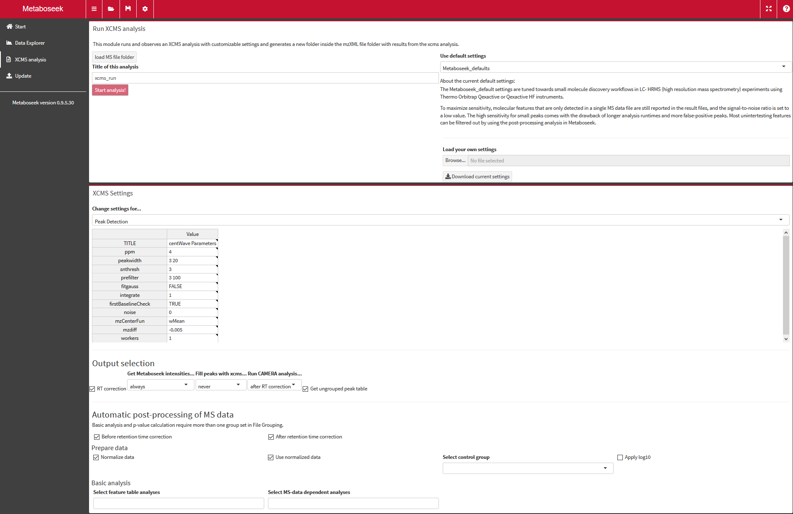

```{r setup, include=FALSE}
knitr::opts_chunk$set(echo = TRUE)
library(Metaboseek)
```


```{r, eval = TRUE, echo = FALSE}

print(paste("Metaboseek version:",packageVersion("Metaboseek")))
```
Metaboseek is an interactive, browser-based tool to analyze and browse your mass spectrometry data. Here is a quick introduction to the basic functions.

# Install Metaboseek

## System requirements

Recommended minimal system requirements:

* Quad-core processor (or dual core with 4 threads)
* 8 GB of RAM (16 GB or more are preferred)
* Recent versions of Firefox or Chrome web browsers (Metaboseek should work on any browser, but testing is done for these two)

We recommend computers with a monitor with at least full HD (1920 x 1080 pixels) resolution. You can use the zoom function of your web browser to scale the interface to your liking.

All files are loaded into memory, so that browsing will be very quick: It is easy to look at extracted ion chromatograms (EICs) for many MS features of interest across dozens of files within a fraction of a second. However, the initial loading of the data will take some time, and you may experience issues if you load many files at a time. We strongly recommend using centroided data files, as they will have a smaller memory footprint. Loading 50 data files from 20-minute high resolution LC/MS data acquisition should not be a problem on a computer with 16 GB of RAM. 

### Java {#javainfo}
If installed from an R session, Metaboseek will require Java to be installed for full functionality (in particular, molecular structure plotting in the SIRIUS module. Java is also a requirement for installing SIRIUS itself). Make sure to install 64-bit Java if you are running 64-bit R (which is most likely), or 32-bit Java if you are running 32-bit R. If you go to java.com and follow the download buttons there, it will send you to download the version that corresponds to your browser (32- or 64-bit) by default, which may or may not be the version you need. Get the appropriate Java version from this page: [https://www.java.com/en/download/manual.jsp](https://www.java.com/en/download/manual.jsp). 

## Install on Windows

###Using the installer

1. Download the installer of the most recent release version <a href="https://github.com/mjhelf/Metaboseek/releases" target = "_blank">here</a>
2. Follow the installation steps.
3. Metaboseek 0.9 should now be installed and can be launched like any other Windows program. When Metaboseek launches, a command line window will appear, and the user interface will open up in your default web browser. To close the program, close the Metaboseek command line window.

The installer version of Metaboseek has one limitation: it does not plot molecular structures for predicted structures in the SIRIUS module. This is a compromise made so that this installation of Metaboseek does not require Java to be installed on your system.

###Using a .zip file

1. Download the .zip file of the most recent release version <a href="https://github.com/mjhelf/Metaboseek/releases" target = "_blank">here</a>
2. Unzip the file on your computer (this may take a while!)
3. Run Metaboseek by executing runMetaboseek.exe In the unzipped folder.

The .zip version of Metaboseek has one limitation: it does not plot molecular structures for predicted structures in the SIRIUS module. This is a compromise made so that this installation of Metaboseek does not require Java to be installed on your system.

<!-- ###Updating Metaboseek for Windows -->

<!-- Windows users can update Metaboseek to the newest version from inside the Metaboseek app (Update/Help section in the navigation bar on the left). This method is easier than downloading a new installer or .zip file, but currently updates can fail, especially when there are a lot of changes to Metaboseek. -->

## Install on Mac / Linux
Consider getting the [Metaboseek Docker image](#Docker), or follow these steps to install Metaboseek:

1.	<a href="https://cloud.r-project.org/" target = "_blank">Download</a>.
2.	Mac users: Get Xcode by entering this line into your `Terminal` window:
```
xcode-select --install
```
Follow the instructions. This will install parts of Xcode that are required to install Metaboseek.
3.	Run R, enter this line:
```{r, eval = FALSE}
source("http://metaboseek.com/files/install_Metaboseek.R") 
```
* If there is an error during installation, try to additionally install
<a href="https://itunes.apple.com/us/app/xcode/id497799835?mt=12" target = "_blank">Xcode</a> from the AppStore.
5. To run Metaboseek, enter this line into your R console:
```{r, eval = FALSE}
Metaboseek::runMseek()
```
* If Metaboseek starts up, but an unresponsive grey screen appears, there is most likely an issue related to the rcdk package and Java). Restart R and enter this line:
```
remove.packages('rcdk')
```
Then try to run Metaboseek again.


## Get the Docker image {#Docker}

As they put it on their website, "Docker provides a way to run applications securely isolated in a container, packaged with all its dependencies and libraries.". This is also a convenient way to reproduce analysis results that were generated with a particular version of Metaboseek. Once you have set up Docker on your computer, this is the easiest and most reproducible way to get fully functional Metaboseek, including [SIRIUS](https://bio.informatik.uni-jena.de/software/sirius/) integration. 

1. [Install](https://docs.docker.com/install/) and [set up](https://docs.docker.com/get-started/) Docker. Please note that there are limitations for Windows users (Windows 10 Pro is required and using Docker prevents running Virtual Machines with VM VirtualBox).
2. You can now get the [Metaboseek Docker image](https://hub.docker.com/r/mjhelf/metaboseek) using this terminal command:
```
docker pull mjhelf/metaboseek
```
The metaboseek Docker image is based on the [`bioconductor/release_metabolomics2`](https://hub.docker.com/r/bioconductor/release_metabolomics2) image.
3. Running this command will execute the latest version of the Metaboseek container (and download it if not already available on your computer):
```
docker run -d -v HOSTFOLDER:/home/shiny/data -p 3840:80 -e PASSWORD=YOURPASSWORD mjhelf/metaboseek
```
Lets take a look at some key settings here:

* `HOSTFOLDER` should be the path of a folder on your computer that contains all data that you want to analyze with Metaboseek, for example if used like this:
```
docker run -d -v /home/user123:/home/shiny/data -p 3840:80 -e PASSWORD=YOURPASSWORD mjhelf/metaboseek
```
**NOTE:** The apps hosted inside the container will be accessible from the internet (for anyone connecting to your computer's IP address and the correct port number). By default, they will be protected by HTTP basic authentication, but that is not 100% secure. Once authenticated, the apps allow seeing the data structure of the specified HOSTFOLDER, and it is possible to download arbitrary .csv files and MS data from that folder. We are not liable for any data exposure to unauthorized parties or other [damages](https://github.com/mjhelf/METABOseek/blob/master/LICENSE).

All contents of the `/home/user123` folder will be acessible in Metaboseek.
* `-p 3838:3838` means that port 3838 from the container will be accessible as port 3840 on the host computer.

* `-e PASSWORD=YOURPASSWORD` this password has to be set. It can be used if you want to access rstudio inside the container, and is necessary to access the Metaboseek apps.

* You can disable authentication for the apps by adding `-e PROTECTED=false` to this command, for instance to provide convenient public access to your data. **WARNING: This makes the apps accessible from the internet (see note above)**

4. Check if the Metaboseek container is running:
```
docker ps
```
5. Go to your web browser and go to the website `localhost:3840`, where the port number after the colon may differ based on your `-p` setting (see above). By default, you will have to log in, with the username `metaboseek` and the password you specified (`YOURPASSWORD` in our example). This will open a website, hosted inside the metaboseek container. Select the app you want to run and analyze your data!


##	Experienced R users (Windows, Mac or Linux):
If you have installed R (and the devtools package) already, you can install Metaboseek like this:

```{r, eval = FALSE}
devtools::install_github("mjhelf/MassTools")
devtools::install_github("mjhelf/Metaboseek")
```
If you want to make sure you get all the required packages, run the install script with this line:

```{r, eval = FALSE}
source("http://metaboseek.com/files/install_Metaboseek.R") 
```	


## Use the web version
If you have trouble installing Metaboseek and want to just try it out with an example dataset, use the [web version.](https://metaboseek.com/)

<!-- #Quickstart -->

<!-- The easiest way to try out some basic funcionality is to load in the example data. In the online version, the data is already preloaded, and you can skip the first step that describes how to load the data. -->

#Data analysis with Metaboseek

With Metaboseek, you can quickly visualize data from batches of high-resolution LC/MS data files and find differences between groups of samples. It is not necessary to do any analysis before looking at your data, but a typical workflow starts with a data analysis step:

* Detection of MS features (defined by m/z and retention time) with the [xcms analysis module](#runXcms)
  + alternatively, you can use an MS feature list that you generated elsewhere.
* Molecular networking of MS2 spectra
* Structure prediction using [SIRIUS](https://bio.informatik.uni-jena.de/software/sirius/)

Then, you can use Metaboseek to browse the data, find molecular features of interest, predict the molecular formula and make structure predictions based on MS2 data.

## Overview
Metaboseek is structured into two major sections, the `Data Explorer` section for visualization and statistical analysis tasks, and the `XCMS analysis` to identify LC/MS features in MS data files. You can switch between these sections with the navigation menu on the left of the screen. 

##Start Page / Loading Data {#loadMSData}

{width=100%}


The <svg style="height:0.8em;top:.04em;position:relative;" viewBox="0 0 576 512"><path d="M280.37 148.26L96 300.11V464a16 16 0 0 0 16 16l112.06-.29a16 16 0 0 0 15.92-16V368a16 16 0 0 1 16-16h64a16 16 0 0 1 16 16v95.64a16 16 0 0 0 16 16.05L464 480a16 16 0 0 0 16-16V300L295.67 148.26a12.19 12.19 0 0 0-15.3 0zM571.6 251.47L488 182.56V44.05a12 12 0 0 0-12-12h-56a12 12 0 0 0-12 12v72.61L318.47 43a48 48 0 0 0-61 0L4.34 251.47a12 12 0 0 0-1.6 16.9l25.5 31A12 12 0 0 0 45.15 301l235.22-193.74a12.19 12.19 0 0 1 15.3 0L530.9 301a12 12 0 0 0 16.9-1.6l25.5-31a12 12 0 0 0-1.7-16.93z"/></svg> `Start` page provides you with information
about the newest version of Metaboseek, and also allows you to load data into Metaboseek. You can also click on the <svg style="height:0.8em;top:.04em;position:relative;" viewBox="0 0 576 512"><path d="M572.694 292.093L500.27 416.248A63.997 63.997 0 0 1 444.989 448H45.025c-18.523 0-30.064-20.093-20.731-36.093l72.424-124.155A64 64 0 0 1 152 256h399.964c18.523 0 30.064 20.093 20.73 36.093zM152 224h328v-48c0-26.51-21.49-48-48-48H272l-64-64H48C21.49 64 0 85.49 0 112v278.046l69.077-118.418C86.214 242.25 117.989 224 152 224z"/></svg> `Load` icon on the left side of the navigation bar at the top of the page to get the same set of options for loading data:

###Load feature tables
[You can load any .csv or .mskFT file into Metaboseek](#supportedFiles). You can
then go to the "Regroup Table" tab to specify or change the columns that contain intensity values.
Feature Tables contain the results from feature detection with xcms, along with
results from statistical analysis. If you load an `.mskFT` file, important metadata, such as
processing history and sample grouping are loaded along with the result table.
If you have loaded a project folder into the current session, there is a convenient option to select
all compatible table files from the project folder as well.

###Loading MS data files directly.{.unnumbered}
All files with [supported file extensions](#supportedFiles) in the selected 
folders and all its subfolders can be imported, either by selecting files
individually (selecting multiple files at a time is possible), or by importing 
an entire folder that contanis MS data (will import all compatible files from 
all subfolders, too). To save time, it makes sense to pre-sort 
your files in a reasonable folder structure (e.g. separate positive mode data
from negative mode so you don't get both kinds when selecting a folder to load
into Metaboseek). Loading MS data files after you have already loaded a project 
folder allows you to visually inspect files that you had excluded from the 
[xcms analysis](#runXcms), such as blanks.

### Load a Metaboseek project folder.{#projectFolders}
When you run [xcms through Metaboseek](#runXcms), the program generates a 
project folder that contains the results from that xcms analysis run, and all 
settings that were used in it. In addition, all output feature tables you 
requested will be saved in the project folder during the xcms run.
You can load this result folder into Metaboseek, making it easier to keep all
analysis results related to this xcms run in one place.

You can either select a project folder anywhere on your computer, or select a 
project folder from the recent project selection window that lists the most recently
used project folders (load the selected folder with the `Load Recent` button).
If you chose to load a project folder, all MS data files from the xcms run will be 
loaded and sample grouping information from the xcms analysis will be applied.
Metaboseek will ask you which feature table you want to load
from the project folder. If you select an `.mskFT` file (recommended) instead of 
the corresponding `.csv` file, you will benefit from the additional information embedded in these files. 
`.csv` files are primarily there for export and viewing in other tools (and even Microsoft Excel),
 while `.mskFT` files are designed to be loaded back into Metaboseek. The advantage of 
 `.mskFT` files is that they contain the complete processing history (including
 settings used for the xcms run, CAMERA analysis and post-processing). `.mskFT` files 
 are technically `.RDS` files containing an `MseekFT` object and can be loaded 
 into any R session with the `readRDS()` function.
 
####Load Example Data
You can select "example_projectfolder" from the "Recent projects" selection box and click on "Load recent".
Metaboseek will ask you which table you would like to load into the session along with the MS data that is associated with the exammple project folder.

### Load a Metaboseek session
You can load a Metaboseek session that you saved previously in an `.msks` file. 
This will restore all feature tables and MS data files you had loaded into that session along with
many of the layout settings.
**Note:** This will currently only work if the MS data file locations have not 
changed from the paths used in the old session. Some aspects of the session will
not be restored (notably, MS2 networks are not saved in the session file).


### Supported file types {#supportedFiles}

Metaboseek uses the `MSnbase` and `xcms` packages to load MS data files of the following formats:

* .cdf
* .nc
* .mzData
* .mzML
* .mzXML

Feature Tables can be loaded in these formats:

* .csv : comma-separated values. Metaboseek will expect a column `mz` with m/z values and a column `rt` 
with retention time values in seconds.
* .mskFT: Metaboseek's format to keep feature tables with metadata, including processing history

## Data Explorer

At the heart of Metaboseek is the interaction between data visualization in the "Data viewer" box, and a table of LC/MS data features in the `Feature table` box

###Options box

This box provides a number of optional functionality, including setting up SIRIUS,
calculating molecular formulas and controling the appearance of extracted ion 
chromatograms (EICs) in the `Data Viewer` box.

####Sirius options

####Molecular formula prediction

####RT correction

####Mass shifts

####EIC options


###Data Viewer

This box provides plots of data that is selected in the `Feature Table` box.
Different kinds of data plots and browsing options are available, mostly for 
extracted ion chromatograms (EICs) and spectrum plots, but also bar plots,
venn diagrams and plots from principal component analysis.


####MS2 Browser

If you have [loaded MS data files](#loadMSData) which contain MS/MS data, go 
to the `MS2 browser` tab in the `Data viewer` box to look at MS/MS scans in one of two ways:

1. **Use the feature table:** When you select one (or multiple) entries in the 
`Feature Table`, Metaboseek will find any MS/MS scans that have a parent mass 
matching the selected `Feature Table` entry (e.g. within 5 ppm and 200 seconds,
customizable).

2. **Use the molecular network viewer:** If you have loaded or generated a 
molecular network, you can also display spectra for each network node, as long 
as the files used to generate the network are [loaded into Metaboseek.](#loadMSData)
Navigate from the network overview to a contingent network cluster (or "subgraph")
by clicking on it while holding the `SHIFT` key. The view will now zoom in on the
subgraph. You can use the control menu above the network to show node and edge labels
of your choice (e.g. Parent m/z and m/z difference between nodes ("deltaMZ")),
and apply a coloring scheme (e.g. color by default groups). To select a node and
display all MS/MS spectra associated with it, click on a node while holding the
`SHIFT` key.

You can move nodes by dragging them with your mouse while holding the `CTRL` key 
(this helps make all labels visible in a dense network). Return back to the network
overview by double clicking on the graph. If double-clicking does not work,
you can also zoom out by clicking while holding the `Z` key.


#####Get structure predictions with SIRIUS

[SIRIUS](https://bio.informatik.uni-jena.de/software/sirius/) (@Duhrkop2019) is a stand-alone software developed in the Boecker lab at the University of Jena that can use MS/MS data to predict the molecular formulas of fragment and parent ion peaks. It also offers an interface to CSI:FingerID to match fragmentation patterns with structure databases.

MS2 data can be analyzed with SIRIUS from inside the Metaboseek app. For this to work, you first need to tell Metaboseek where the SIRIUS executable is located. Click on the "Global settings for Metaboseek" button at the top of the app (gear symbol, next to the "Open..." button). Select the SIRIUS folder. Metaboseek will generate a new folder there to store results from Sirius runs.

To run Sirius, use the "Run SIRIUS" Button above the MS2 scan table. Make sure to select appropriate options in the "Sirius options" section at the top of the app (Options box).
The results can be accessed through Metaboseek as soon as a Sirius analysis run finishes by clicking "Show SIRIUS". Select items in the tables that show up to view fragmentation trees and proposed structures.

#####Manage and compare MS2 spectra{.unnumbered}

All MS/MS scans matching a selection (from a network or from the `Feature Table`) are shown in a table in the `MS2 browser` tab. An average spectrum of all scans shown in this `scan table` is displayed on the left. You can select single or multiple scans in the `scan table` to show the spectrum of only the selected scan(s).

MS/MS spectra are shown on the right side. You can choose to `keep` a spectrum view - it will then not be overridden when you select a new `Feature table` entry or network node. You can show up to 5 spectrum views at the same time. By default, all peaks that occur in more than one of the shown spectra are highlighted in blue. You can disable this comparison with the `Compare` checkbox. You can also download the shown spectrum views in .pdf format by clicking `Download spectra`.

####PCA Viewer

####Venn Diagrams

####Quickplots

####MS Browser

####Grouped EICs

####Regroup MS data

###Feature Table

This box contains the main table and allows selection of molecular features for 
which you want to view data in the `Data Viewer`.

###Feature Table Actions

In this box you can run analyses on the currently selected `Feature Table` and filter it.

####Filter Table

####Analyze Table

The `Analyze Table` tab is the central hub for data analysis on your
`Feature Table`. Most analysis steps will generate new columns in the `Feature Table`
which you can then use to filter your table to get to your features of interest.
[See below](#columnExplain) for a guide to the columns generated by the analysis
steps. 

#####Analysis options

For more in-depth information on the underlying functions in `R`, see <a href="https://rdrr.io/github/mjhelf/METABOseek/man/analyzeFT.html" target = "_blank"> the Metaboseek::analyzeFT documentation</a>.

* **Normalize data: **Select this option ONLY if the current table has not been 
filtered and is the result of an unbiased xcms analysis. "Normalization" will make a copy
of the current intensity columns with the suffix "__norm". In these new columns, 
all zero intensity values will be set to the lowest non-zero value across all
sample intensity columns (assuming it represents the detection limit). Then, a 
normalization factor is applied so that the average intensiy of each individual
column is the same and equal to the average intensity across all columns prior to 
normalization. **If you do this on a table that has been pre-filtered, for instance 
containing only features that are upregulated in one sample group, this will fatally
distort the data!**

* **Use normalized data: ** Use the normalized data for when running analyses that 
use intensity values: Basic Analysis, anova, t-test, PCA, clara cluster

* **Select control group:** Select a sample group that is the control (in Basic Analysis, all sample groups are compared to this group).

* **Apply log10:** When checked, will apply log10 to the "__norm columns" (see above) **after** normalization of intensity values.

#####Basic analysis

* **Basic analysis:** Selecting this option will calculate a set of fold changes 
between sample groups and some summary information columns such as `maxint`.
[See below](#columnLegend) for a description of all columns generated by this 
analysis step.

* **clara cluster:** cluster the feature table with cluster::clara()

* **anova:** Calculate per-row one-way ANOVA between grouped columns of the feature table. NOTE: Equal variance is not assumed (uses stats::oneway.test), returns NaN in cases where one group has all equal values (no variance, e.g. if all values are 0).

* **t-test:**  calculate t-test between samples. Works only if there are two groups in grouping with multiple members.

* **PCA features:** Perform Principal Component Analysis (PCA) of features (does not require grouping information). will add columns to the feature table.

* **PCA samples:** Calculate Principal Component Analysis to cluster samples based on the intensity columns (does not require grouping information). sample PCA information is not stored in the viewable feature table, but is saved as part of an .mskFT file.

* **mzMatch: ** Match the m/z values of your featureTable to a list of known compounds.
Note that these matches based on MS1 data alone are ambiguous. Will generate multiple columns
in the `Feature Table`, as described [below](#columnLegend).

* **Peak shapes:** Tries to match the EIC for each feature in each sample to a curve and calculates a fit score between 0 (no fit) and 1 (best fit).

* **Fast peak shapes:** Recommended way to score peak shapes. Tries to match the EIC for each feature in the sample with the highest intensity for each feature to a curve and calculates a fit score between 0 (no fit) and 1 (best fit). Much faster than "Peak shapes", with equivalent or better results.

#####Advanced analysis

* **Get intensities:** For each molecular feature, an EIC is generated across 
all MS files currently loaded in the MS data layout. The retention time boundaries
of the EIC can be chosen to be seconds around the features retention time (rt)
or around its peak boundaries as reported in the rtmin and rtmax columns of the 
feature table. If retention time correction information is used, the EIC 
retention time window is moved accordingly for each file. Intensities within 
this EIC range are averaged and reported for each file. Alternatively, the peak areas
can be calculated instead of the average intensities, leading to results that are 
more easily comparable to xcms-based intensities.

* **Find MS2 scans:** Find MS2 scans corresponding to each feature in the Feature Table. Allows setting of m/z and RT tolerances, will add a column to the Feature Table with information about the scans. This column is used by the MS2 browser Module to identify feature-specific spectra for MS2 networking.

* **MS2 patterns:** Allows to search for combinations of MS2 fragment peaks in all loaded MS data files.

* **Find peaks: ** For each m/z value in the feature table, an EIC for the full 
retention time range is generated, and a simple peak detection algorithm is 
applied to identify maxima that stand out from background noise.

<details>
    <summary>Click here for details on the peak detection algorithm</summary>
    
    the peakDetect() function uses a modified version of an algorithm presented by Ma et al.24 as follows:
For the global noise level, let $N $ be the number of EIC data points, and $S_{i}$ the intensity value of the $i^{th}$ data point. $K$ is a user definable variable.
$GlobalNoiseThreshold = (GlobalMaximum + GlobalAverage)/100 + K * Deviation$
 where :
$GlobalAverage = \displaystyle \frac{\sum_{i=1}^N|S_{i}|}{N}$; $Deviation = \displaystyle \frac{\sum_{i=1}^N|S_{i} - GlobalAverage|}{N}$
In addition to the global noise threshold, a local noise threshold is calculated for each data point $S_{i}$ in the EIC, using a similar equation limited to a small retention time window around $S_{i}$. Let $n$ be the number of scans to consider for local noise level calculation in each direction, and $noise_{i}$ the local noise level for a data point in the EIC.
$noise_{i} = (LocalMaximum + LocalAverage)/2 + K * Local Deviation$
$LocalAverage = \displaystyle \frac{\sum_{i-n}^{i+n}|S_{i}|}{2n + 1}$; $LocalDeviation = \displaystyle \frac{\sum_{i-n}^{i+n}|S_{i} - LocalAverage|}{2n + 1}$
In a first step, all local maxima and their adjacent minima in an EIC are detected, and peak boundaries are defined by the two minima surrounding a maximum. Peaks are selected if their maximum is above both the local noise level at its position in the EIC and above the global noise level. If two peaks are adjacent, and the local minimum that separates them is at least 1/3 the intensity of either peak maximum, these two peaks are merged. Additional filters include selection for peaks spanning at least a given number of scans, and a factor by which a peak maximum has to be above the average intensity inside the peak boundaries.
Peaks are merged between files by first matching peaks with maxima within a specified retention time window. The peak boundary and maximum position are then calculated from the weighted average boundary and maximum positions of all peaks that are matched, weighted by the maximum intensity of each peak.
</details>

* **Calculate m/z:** Allows to calculate m/z values from molecular formulas that are written out in a column of the Feature Table (without charge).

####Regroup Table

### Special Columns in the Metaboseek Feature Table{#columnExplain}

```{r column legend, echo = FALSE}

coldf <- read.csv("assets/columnLegend.csv")

colnames(coldf) <- c("Column", "Description", "calculated by", "method")

knitr::kable(coldf[,1:3])


```


##XCMS analysis {#runXcms}

This section will help you to set up an xcms analysis in Metaboseek in order to identify LC/MS features that are differential between sets of data files. This can, for instance, be useful to assess the impact of a mutation on the metabolome of an organism or to identify compounds associated with the activity of an enzyme.

{width=100%}

1. Select a folder with MS data files. All files with 
[supported file extensions](#supportedFiles) in the selected folders and all its
subfolders will be listed, so it makes sense to pre-sort your files in a reasonable
folder structure:
  + All files should be acquired under comparable conditions, especially with 
  the same polarity. Differences in LC gradient or general composition (e.g. 
  through widely different extraction methods, or comparing samples and blanks) 
  can also make it difficult to apply retention time correction and find 
  differential features.
2. There are 7 tables with xcms settings you can change here. Navigate through 
them with the drop down menu highlighted as (2.). A short description for each 
parameter is given when you hover over the table entries. You can use the 
default settings and proceed to step 3 without changing any of them. 
The default is for highly similar LC/MS runs acquired at high resolution and 
high accuracy (< 5 ppm), and will find relatively small peaks (even if they only
occur in a single replicate). While these settings allow for detection of small
peaks, the processing time is relatively long and many false-positives 
(non-peaks) will also end up in the feature table.

  <details>
    <summary>Click here for details about the xcms settings</summary>

  + **Peak Detection:** set parameters for the [`xcms::findChromPeaks()` function](https://rdrr.io/bioc/xcms/man/findChromPeaks-centWave.html#heading-2)
  + **Peak Filling:** These settings specify how to look for intensities for 
  molecular features in all files, even in files where no peak was detected for
  that feature in the initial Peak Detection step. The xcms peak filling 
  parameters will be used if you select the "Fill peaks with xcms..." output
  option below. Technically, you are setting parameters for the  
  [`xcms::fillChromPeaks()` function](https://rdrr.io/bioc/xcms/man/fillChromPeaks.html).
  You can also set parameters for the Metaboseek peak intensity functions here,
  which will extract intensities for all molecular features in all files.
  + **Feature Grouping:** set the parameters for how xcms will group peaks from different
  files together (also known as correspondence analysis) so that intensities can
  be compared across files. These parameters are used for a call to 
  [`xcms::groupChromPeaks` with `xcms::PeakDensityParam`](https://rdrr.io/bioc/xcms/man/groupChromPeaks-density.html).
  + **Output files:** select which output files you want to get. The values in this 
  table can more conveniently be set in the user interface below the tables
  ("Output selection" section).
  + **CAMERA settings:** Settings for isotope peak and adduct annotation with the
  `CAMERA` package. `Metaboseek` sequentially runs the `CAMERA` package functions
  `xsAnnotate`, `groupFWHM`, `groupCorr`, `findIsotopes` and `findAdducts`
  which are described in the [`CAMERA` documentation](https://bioconductor.org/packages/release/bioc/html/CAMERA.html).
  + **RT correction:** Settings for retention time correction, using 
  [`xcms::adjustRtime`](https://rdrr.io/bioc/xcms/man/adjustRtime.html) either 
  using the [`Obiwarp`](https://rdrr.io/bioc/xcms/man/adjustRtime-obiwarp.html)
  or the [`peakGroups`](https://rdrr.io/bioc/xcms/man/adjustRtime-peakGroups.html)
  method. If `Obiwarp` is selected and fails, the xcms runner script will attempt to run 
  `peakGroups` with the given paramters.
  </details>
  
3. Start the analysis with a click on the "Start analysis!" button.
  + Once the analysis is running, Metaboseek will generate a Project Folder for
  you, containing settings and results from your xcms run. You can load the
  Project Folder back into Metaboseek to keep all your analysis results in one 
  place. See [Project Folders](#projectFolders) for more information.
4. You can save settings as a .zip file (on windows computers, 7-zip or other software allowing for the zip command line prompt must be installed), or load a .zip file with settings from a previous run.
 + Note that loading settings will override your selection of MS data files. If you want to apply the settings to a new set of data files, load the settings first and then select a folder (step 1).
 
# References

